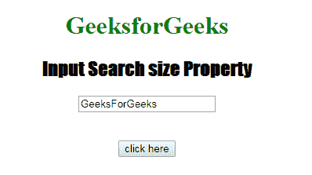
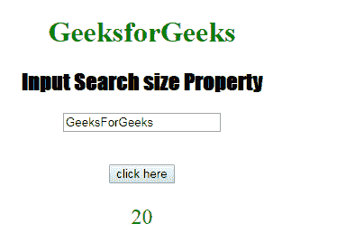
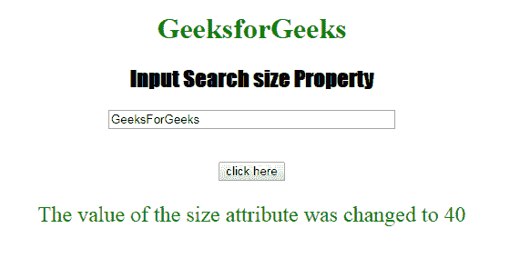

# HTML | DOM 输入搜索大小属性

> 原文:[https://www . geesforgeks . org/html-DOM-input-search-size-property/](https://www.geeksforgeeks.org/html-dom-input-search-size-property/)

HTML DOM 中的 **DOM 输入搜索大小属性**用于**设置**或**返回** *输入搜索字段*的大小属性值。大小属性用于定义搜索字段的宽度。它的默认值是 20。

**语法:**

*   它返回输入搜索大小属性。

```html
searchObject.size
```

*   它用于设置输入搜索大小属性。

```html
searchObject.size = number
```

**属性值:**包含单个数值，用于根据字符数指定搜索字段的宽度。
**返回值:**返回代表搜索字段宽度的数值，以字符数表示。
**示例-1:** 本示例说明如何返回 Input 搜索大小属性。

## 超文本标记语言

```html
<!DOCTYPE html>
<html>

<head>
    <title>
      Input Search size Property
  </title>
    <style>
        h1 {
            color: green;
        }

        h2 {
            font-family: Impact;
        }

        body {
            text-align: center;
        }
    </style>
</head>

<body>

    <h1>GeeksforGeeks</h1>
    <h2>Input Search size Property</h2>
    <form id="myGeeks">
        <input type="Search"
               id="test"
               placeholder="Type to search.."
               value="GeeksForGeeks"
               size="20">
    </form>
    <br>
    <br>
    <button ondblclick="Access()">
      click here
    </button>

    <p id="check"
       style="font-size:24px;
              color:green;">
  </p>

    <script>
        function Access() {

            // type="search"
            var s = document.getElementById(
                "test").size;

            document.getElementById(
                "check").innerHTML = s;
        }
    </script>

</body>

</html>
```

**输出:**
**点击按钮前:**



**点击按钮后:**



**示例-2:** 该示例说明如何**设置**输入搜索大小属性。

## 超文本标记语言

```html
<!DOCTYPE html>
<html>

<head>
    <title>
      Input Search size Property
  </title>
    <style>
        h1 {
            color: green;
        }

        h2 {
            font-family: Impact;
        }

        body {
            text-align: center;
        }
    </style>
</head>

<body>

    <h1>GeeksforGeeks</h1>
    <h2>Input Search size Property</h2>
    <form id="myGeeks">
        <input type="Search"
               id="test"
               placeholder="Type to search.."
               value="GeeksForGeeks"
               size="20">
    </form>
    <br>
    <br>
    <button ondblclick="Access()">
      click here
    </button>

    <p id="check"
       style="font-size:24px;color:green;">
  </p>

    <script>
        function Access() {

            // type="search"
            var s = document.getElementById(
                "test").size = "40";

            document.getElementById(
                "check").innerHTML =
            "The value of the size attribute was changed to "
            + s;
        }
    </script>

</body>

</html>
```

**输出:**
**点击按钮前:**


**点击按钮后:**



**支持的浏览器:**T2 DOM 输入搜索大小属性支持的浏览器如下:

*   谷歌 Chrome
*   Internet Explorer 10.0 +
*   火狐浏览器
*   歌剧
*   旅行队