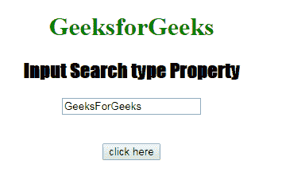

# HTML | DOM 输入搜索类型属性

> 原文:[https://www . geesforgeks . org/html-DOM-input-search-type-property/](https://www.geeksforgeeks.org/html-dom-input-search-type-property/)

HTML DOM 中的 **DOM 输入搜索类型属性**用于**返回**搜索字段的*表单元素的类型。它总是返回输入搜索字段的文本。*

**语法:**

```html
searchObject.type
```

**返回值:**返回一个字符串值，代表搜索字段的表单元素类型

下面的程序说明了 HTML DOM 中的搜索类型属性:
**示例:**本示例返回搜索字段的表单元素的类型。

## 超文本标记语言

```html
<!DOCTYPE html>
<html>

<head>
    <title>
      Input Search type Property
  </title>
    <style>
        h1 {
            color: green;
        }

        h2 {
            font-family: Impact;
        }

        body {
            text-align: center;
        }
    </style>
</head>

<body>

    <h1>GeeksforGeeks</h1>
    <h2>Input Search type Property</h2>
    <form id="myGeeks">
        <input type="Search"
               id="test"
               placeholder="Type to search.."
               value="GeeksForGeeks">
    </form>
    <br>
    <br>
    <button ondblclick="Access()">
      click here
    </button>

    <p id="check"
       style="font-size:24px;
              color:green;">
  </p>

    <script>
        function Access() {

            // type="search"
            var s = document.getElementById(
                "test").type;

            document.getElementById(
                "check").innerHTML = s;
        }
    </script>

</body>

</html>
```

**输出:**
**点击按钮前:**



**点击按钮后:**


**支持的浏览器:**T2 DOM 输入搜索类型属性支持的浏览器如下:

*   谷歌 Chrome
*   Internet Explorer 10.0 +
*   火狐浏览器
*   歌剧
*   旅行队