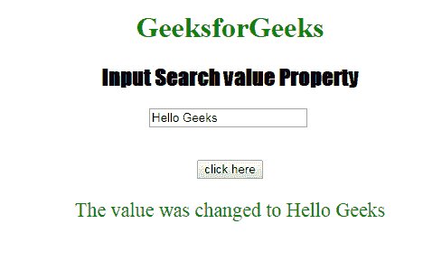

# HTML | DOM 输入搜索值属性

> 原文:[https://www . geesforgeks . org/html-DOM-input-search-value-property/](https://www.geeksforgeeks.org/html-dom-input-search-value-property/)

HTML DOM 中的 **DOM 输入搜索值属性**用于设置或返回*搜索字段*的值属性的值。值属性指定输入文本字段的初始值。它包含默认值或用户类型。

**语法:**

*   它返回 value 属性。

    ```html
    searchObject.value
    ```

*   它用于设置值属性。

    ```html
    searchObject.value = text
    ```

**属性值:**包含单值**文本**，定义输入搜索字段的值。

**返回值:**返回代表搜索字段值的字符串值。

**示例-1:** 本示例说明如何返回 Input 搜索值属性。

```html
<!DOCTYPE html>
<html>

<head>
    <title>
      Input Search value Property
  </title>
    <style>
        h1 {
            color: green;
        }

        h2 {
            font-family: Impact;
        }

        body {
            text-align: center;
        }
    </style>
</head>

<body>

    <h1>GeeksforGeeks</h1>
    <h2>Input Search value Property</h2>

    <input type="Search"
           id="test" 
           placeholder="Type to search.."
           value="GeeksForGeeks">
    <br>
    <br>
    <br>
    <button ondblclick="Access()">click here
    </button>

    <p id="check" 
       style="font-size:24px;
              color:green;">
  </p>

    <script>
        function Access() {

            // type="search" 
            var s = document.getElementById(
                "test").value;
            document.getElementById(
                "check").innerHTML = s;
        }
    </script>

</body>

</html>
```

**输出:**
**点击按钮前:**


**点击按钮后:**


**示例-2:** 该示例说明如何**设置**输入搜索值属性。

```html
<!DOCTYPE html>
<html>

<head>
    <title>Input Search value Property</title>
    <style>
        h1 {
            color: green;
        }

        h2 {
            font-family: Impact;
        }

        body {
            text-align: center;
        }
    </style>
</head>

<body>

    <h1>GeeksforGeeks</h1>
    <h2>Input Search value Property</h2>

    <input type="Search"
           id="test"
           placeholder="Type to search.."
           value="GeeksForGeeks">
    <br>
    <br>
    <br>
    <button ondblclick="Access()">
      click here
    </button>

    <p id="check" 
       style="font-size:22px;color:green;">
  </p>

    <script>
        function Access() {

            // type="search" 
            var s = document.getElementById(
                "test").value = "Hello Geeks";

            document.getElementById(
                "check").innerHTML = 
              "The value was changed to " + s;
        }
    </script>

</body>

</html>
```

**输出:**
**点击按钮前:**


**点击按钮后:**


**支持的浏览器:****DOM 输入搜索值属性**支持的浏览器如下:

*   谷歌 Chrome
*   Internet Explorer 10.0 +
*   火狐浏览器
*   歌剧
*   旅行队