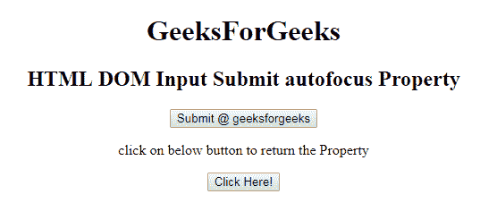
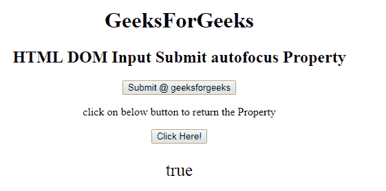
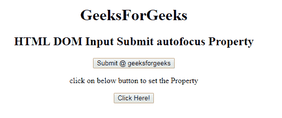
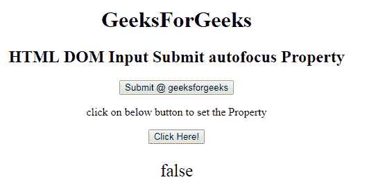

# HTML | DOM 输入提交自动对焦属性

> 原文:[https://www . geesforgeks . org/html-DOM-input-submit-autofocus-property/](https://www.geeksforgeeks.org/html-dom-input-submit-autofocus-property/)

HTML DOM 中的**输入提交自动对焦属性**用于设置或返回页面加载时输入提交字段是否应该对焦。它反映了 HTML 自动对焦属性。

**语法:**

*   它返回自动对焦属性。

```html
submitObject.autofocus

```

*   它用于设置自动对焦属性。

```html
submitObject.autofocus = "true|false"

```

**属性值:**

*   **true:** 设置提交按钮的焦点。
*   **false:** 为默认值。它定义了提交按钮字段不能获得焦点。

**返回值:**返回代表提交字段是否自动对焦的布尔值。

**示例 1:** 本示例返回输入提交自动对焦属性。

## 超文本标记语言

```html
<!DOCTYPE html>
<html>

<head>
    <title>
        HTML DOM Input Submit autofocus Property
    </title>
</head>

<body style="text-align:center;">
    <h1>
        GeeksForGeeks
    </h1>

    <h2>
        HTML DOM Input Submit autofocus Property
    </h2>

    <form id="myGeeks" action="#" method="get" target="_self">

    <input type = "submit" id = "Geeks"
        name="myGeeks" value = "Submit @ geeksforgeeks" autofocus>
    </form>

<p>
        click on below button to return the Property
    </p>

    <button onclick = "myGeeks()">
        Click Here!
    </button>

    <p id = "GFG"style="font-size:25px;"></p>

    <!-- Script to set submit autofocus Property -->
    <script>
        function myGeeks() {
            var btn = document.getElementById("Geeks").autofocus;
            document.getElementById("GFG").innerHTML =btn;
        }
    </script>
</body>

</html>                                 
```

**输出:**
**点击按钮前:**



**点击按钮后:**



**示例 2:** 本示例说明如何设置输入提交自动对焦属性。

## 超文本标记语言

```html
<!DOCTYPE html>
<html>

<head>
    <title>
        HTML DOM Input Submit autofocus Property
    </title>
</head>

<body style="text-align:center;">
    <h1>
        GeeksForGeeks
    </h1>

    <h2>
        HTML DOM Input Submit autofocus Property
    </h2>

    <form id="myGeeks" action="#" method="get" target="_self">

    <input type = "submit" id = "Geeks" name="myGeeks"
        value = "Submit @ geeksforgeeks" autofocus>
    </form>

<p>
        click on below button to set the Property
    </p>

    <button onclick = "myGeeks()">
        Click Here!
    </button>

    <p id = "GFG"style="font-size:25px;"></p>

    <!-- Script to set submit autofocus Property -->
    <script>
        function myGeeks() {
            var btn = document.getElementById("Geeks").autofocus
                    = false;

            document.getElementById("GFG").innerHTML = btn;
        }
    </script>
</body>

</html>                   
```

**输出:**
**点击按钮前:**



**点击按钮后:**



**支持的浏览器:**T2 DOM 输入提交自动对焦属性支持的浏览器如下:

*   谷歌 Chrome
*   Internet Explorer 10.0
*   火狐浏览器
*   歌剧
*   旅行队