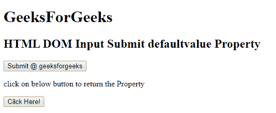
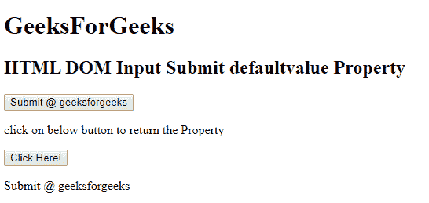
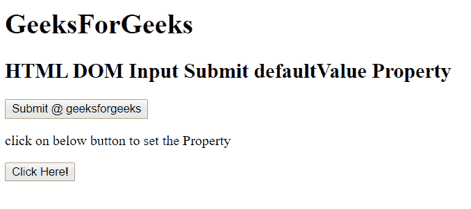
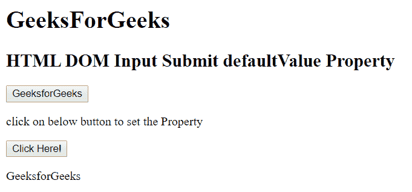

# HTML | DOM 输入提交默认值属性

> 原文:[https://www . geesforgeks . org/html-DOM-input-submit-default value-property/](https://www.geeksforgeeks.org/html-dom-input-submit-defaultvalue-property/)

HTML DOM 中的**输入提交默认值属性**用于设置或返回提交字段的默认值。此属性用于反映 HTML 值属性。默认值与值的主要区别在于，默认值表示默认值，值包含进行一些更改后的当前值。此属性对于确定日期字段是否已更改非常有用。
**语法:**

*   它用于返回 defaultValue 属性。

```html
submitObject.defaultValue
```

*   它用于设置 defaultValue 属性。

```html
submitObject.defaultValue = value
```

**属性值:**包含单个属性值**值**，定义输入提交字段的默认值。
**返回值:**返回一个字符串值，代表输入提交字段的默认值。
**示例 1:** 本示例说明如何返回 Input submit defaultValue 属性。

## 超文本标记语言

```html
<!DOCTYPE html>
<html>

<head>
    <title>
        HTML DOM Input Submit defaultvalue Property
    </title>
</head>

<bodystyle="text-align:center;">
    <h1>
        GeeksForGeeks
    </h1>
    <h2>
        HTML DOM Input Submit defaultvalue Property
    </h2>

    <input type = "submit" id = "Geeks"
            value = "Submit @ geeksforgeeks">

<p>
        click on below button to return the Property
    </p>

    <button onclick = "myGeeks()">
        Click Here!
    </button>

    <p id = "GFG"></p>

    <!-- Script to return submit value Property -->
    <script>
        function myGeeks() {
            var btn = document.getElementById("Geeks").defaultValue;
            document.getElementById("GFG").innerHTML = btn;
        }
    </script>
</body>

</html>
```

**输出:**

*   **点击按钮前:**



*   **点击按钮后:**



**示例 2:** 本示例说明如何设置输入提交默认值属性。

## 超文本标记语言

```html
<!DOCTYPE html>
<html>

<head>
    <title>
        HTML DOM Input Submit defaultvalue Property
    </title>
</head>

<bodystyle="text-align:center;">
    <h1>
        GeeksForGeeks
    </h1>
    <h2>
        HTML DOM Input Submit defaultvalue Property
    </h2>

    <input type = "submit" id = "Geeks"
            value = "Submit @ geeksforgeeks">

<p>
        click on below button
        to set the Property
    </p>

    <button onclick = "myGeeks()">
        Click Here!
    </button>

    <p id = "GFG"></p>

    <!-- Script to return submit value Property -->
    <script>
        function myGeeks() {
            var btn = document.getElementById("Geeks"
                    ).defaultValue ="GeeksforGeeks";

            document.getElementById("GFG").innerHTML
                    = btn;
        }
    </script>
</body>

</html>
```

**输出:**

*   **点击按钮前:**



*   **点击按钮后:**



**支持的浏览器:**T2 DOM 输入提交默认值属性支持的浏览器如下:

*   谷歌 Chrome
*   微软公司出品的 web 浏览器
*   火狐浏览器
*   苹果 Safari
*   歌剧