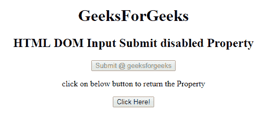
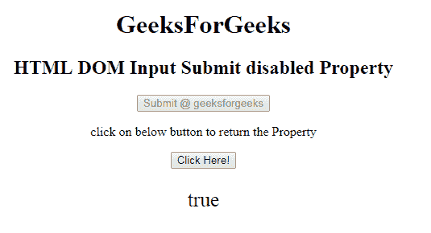
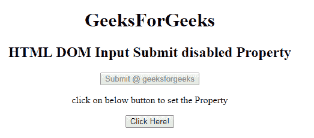
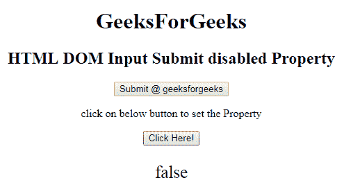

# HTML | DOM 输入提交禁用属性

> 原文:[https://www . geesforgeks . org/html-DOM-input-submit-disabled-property/](https://www.geeksforgeeks.org/html-dom-input-submit-disabled-property/)

HTML DOM 中的**输入提交禁用属性**用于设置或返回代表提交字段是否应禁用的布尔值。默认情况下，禁用的元素以灰色显示，不可用且不可拾取。

**语法:**

*   它返回禁用的属性。

```html
submitObject.disabled
```

*   它用于设置禁用属性。

```html
submitObject.disabled = true|false
```

**属性值:**

*   **true:** 指定禁用提交字段。
*   **false:** 指定提交字段未禁用。

**默认值:**假

**返回值:**返回布尔值，即如果提交字段被禁用，则为真；如果提交字段未被禁用，则为假。

**示例 1:** 本示例返回禁用属性的值。

## 超文本标记语言

```html
<!DOCTYPE html> 
<html> 

<head> 
    <title> 
        HTML DOM Input Submit disabled Property
    </title> 
</head> 

<body style="text-align:center;"> 
    <h1>
        GeeksForGeeks
    </h1>

    <h2> 
        HTML DOM Input Submit disabled Property 
    </h2> 

    <form id="myGeeks" action="#" method="get" target="_self">

    <input type = "submit" id = "Geeks" name="myGeeks"
        value = "Submit @ geeksforgeeks" disabled>
    </form>

<p>
        click on below button to return the Property
    </p>

    <button onclick = "myGeeks()"> 
        Click Here! 
    </button> 

    <p id = "GFG"style="font-size:25px;"></p>

    <!-- Script to set submit disabled Property -->
    <script> 
        function myGeeks() { 
            var btn = document.getElementById("Geeks").disabled;
            document.getElementById("GFG").innerHTML =btn; 
        } 
    </script> 
</body> 

</html>                    
```

**输出:**
**点击按钮前:**



**点击按钮后:**



**示例 2:** 本示例说明如何设置输入提交禁用属性。

## 超文本标记语言

```html
<!DOCTYPE html> 
<html> 

<head> 
    <title> 
        HTML DOM Input Submit disabled Property
    </title> 
</head> 

<body style="text-align:center;"> 
    <h1>
        GeeksForGeeks
    </h1>

    <h2> 
        HTML DOM Input Submit disabled Property 
    </h2> 

    <form id="myGeeks" action="#" method="get" target="_self">

    <input type = "submit" id = "Geeks" name="myGeeks"
        value = "Submit @ geeksforgeeks" disabled>
    </form>

<p>
        click on below button to set the Property
    </p>

    <button onclick = "myGeeks()"> 
        Click Here! 
    </button> 

    <p id = "GFG"style="font-size:25px;"></p>

    <!-- Script to return submit disabled Property -->
    <script> 
        function myGeeks() { 
            var btn = document.getElementById("Geeks").disabled
                    = false;

            document.getElementById("GFG").innerHTML =btn; 
        } 
    </script> 
</body> 

</html>                    
```

**输出:**
**点击按钮前:**



**点击按钮后:**



**支持的浏览器:**支持的浏览器 **DOM 输入提交禁用属性**如下:

*   谷歌 Chrome
*   微软公司出品的 web 浏览器
*   火狐浏览器
*   歌剧
*   旅行队