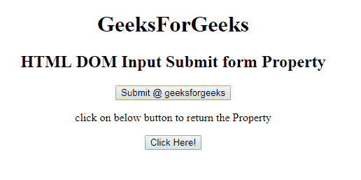
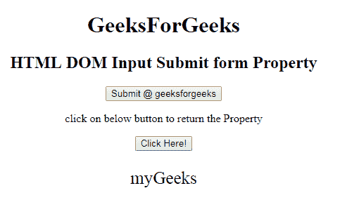

# HTML | DOM 输入提交表单属性

> 原文:[https://www . geesforgeks . org/html-DOM-input-submit-form-property/](https://www.geeksforgeeks.org/html-dom-input-submit-form-property/)

HTML DOM 中的**输入提交表单属性**用于返回包含输入提交字段的表单的引用。它是一个只读属性，在成功时返回表单对象。
**语法:**

```html
submitObject.form
```

**返回值**:返回一个字符串值，指定包含输入提交字段的表单的引用

**示例:**这个示例说明了如何返回 Input Submit 表单属性。

## 超文本标记语言

```html
<!DOCTYPE html>
<html>

<head>
    <title>
        HTML DOM Input Submit form Property
    </title>
</head>

<body style="text-align:center;">
    <h1>
        GeeksForGeeks
    </h1>

    <h2>
        HTML DOM Input Submit form Property
    </h2>

    <form id="myGeeks" action="#" method="get" target="_self">
        <input type = "submit" id = "Geeks" name="myGeeks"
            value = "Submit @ geeksforgeeks" formTarget="_blank"
            formMethod="post">
    </form>

<p>
        click on below button to return the Property
    </p>

    <button onclick = "myGeeks()">
        Click Here!
    </button>

    <p id = "GFG"style="font-size:25px;"></p>

    <!-- Script to set submit form Property -->
    <script>
        function myGeeks() {
            var btn = document.getElementById("Geeks").form.id;
            document.getElementById("GFG").innerHTML = btn;
        }
    </script>
</body>

</html>                   
```

**输出:**
**点击按钮前:**



**点击按钮后:**



**支持的浏览器:**T2 DOM 输入提交表单属性支持的浏览器如下:

*   谷歌 Chrome
*   微软公司出品的 web 浏览器
*   火狐浏览器
*   歌剧
*   旅行队