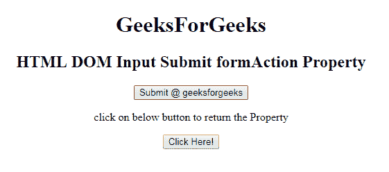
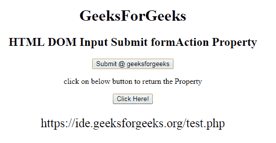
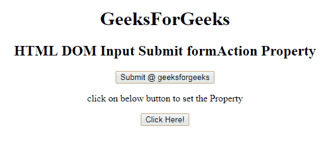
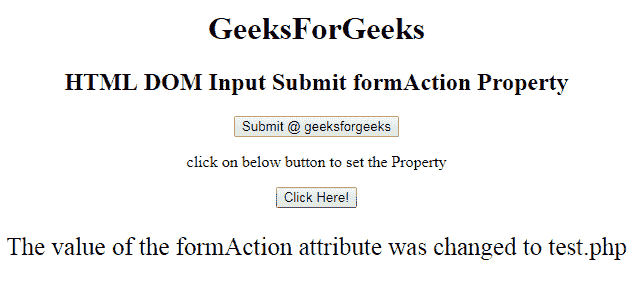

# HTML | DOM 输入提交表单属性

> 原文:[https://www . geesforgeks . org/html-DOM-input-submit-formaction-property/](https://www.geeksforgeeks.org/html-dom-input-submit-formaction-property/)

HTML DOM 中的**输入提交表单属性**用于设置或返回提交按钮的表单属性值。提交表单后，表单属性被调用。表单数据将在提交表单后发送到服务器。它覆盖了<表单>元素的动作属性的特征。
**语法:**

*   它返回 formAction 属性。

```html
submitObject.formAction
```

*   它用于设置 formAction 属性。

```html
submitObject.formAction = URL
```

**属性值:**包含单值**网址**，用于指定表单提交后要发送数据的文档的网址。
网址的可能值为:

*   **绝对 URL:** 它指向一个页面的完整地址。例如:www.geeksforgeeks.org/data-structure
*   **相对网址:**用于指向网页中的文件。例如:gfg.php

**返回值:**返回一个代表表单网址的字符串值。
**示例 1:** 本示例说明如何返回输入提交表单属性。

## 超文本标记语言

```html
<!DOCTYPE html> 
<html> 

<head> 
    <title> 
        HTML DOM Input Submit formAction Property
    </title> 
</head> 

<body style="text-align:center;"> 
    <h1>
        GeeksForGeeks
    </h1>

    <h2> 
        HTML DOM Input Submit formAction Property 
    </h2> 

    <form action="#" method="get" target="_self">
        <input type = "submit" id = "Geeks" name="myGeeks"
            value = "Submit @ geeksforgeeks" formTarget="_blank" 
            formMethod="post" formAction="test.php">
    </form>

<p>
        click on below button to return the Property
    </p>

    <button onclick = "myGeeks()"> 
        Click Here! 
    </button> 

    <p id = "GFG"style="font-size:25px;"></p>

    <!-- Script to return submit formEnctype Property -->
    <script> 
        function myGeeks() { 
            var btn = document.getElementById("Geeks").formAction;
            document.getElementById("GFG").innerHTML = btn; 
        } 
    </script> 
</body> 

</html>                         
```

**输出:**
**点击按钮前:**



**点击按钮后:**



**示例 2:** 本示例说明如何设置输入提交表单属性。

## 超文本标记语言

```html
<!DOCTYPE html> 
<html> 

<head> 
    <title> 
        HTML DOM Input Submit formAction Property
    </title> 
</head> 

<body style="text-align:center;"> 
    <h1>
        GeeksForGeeks
    </h1>

    <h2> 
        HTML DOM Input Submit formAction Property 
    </h2> 

    <form action="#" method="get" target="_self">
        <input type = "submit" id = "Geeks" name="myGeeks"
            value = "Submit @ geeksforgeeks" formTarget="_blank"
            formMethod="post" formAction="www.finecomb.com">
    </form>

<p>
        click on below button to set the Property
    </p>

    <button onclick = "myGeeks()"> 
        Click Here! 
    </button> 

    <p id = "GFG"style="font-size:25px;"></p>

    <!-- Script to set submit formAction Property -->
    <script> 
        function myGeeks() { 
            var btn = document.getElementById("Geeks").formAction
                    = "test.php";

            document.getElementById("GFG").innerHTML
                    = "The value of the formAction attribute "
                      + "was changed to " + btn; 
        } 
    </script> 
</body> 

</html>                    
```

**输出:**
**点击按钮前:**



**点击按钮后:**



**支持的浏览器:**T2 DOM 输入提交表单属性支持的浏览器如下:

*   谷歌 Chrome
*   微软公司出品的 web 浏览器
*   火狐浏览器
*   歌剧
*   旅行队