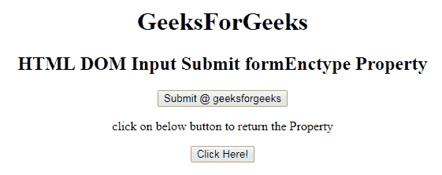

# HTML | DOM 输入提交表单类型属性

> 原文:[https://www . geesforgeks . org/html-DOM-input-submit-formenctype-property/](https://www.geeksforgeeks.org/html-dom-input-submit-formenctype-property/)

HTML DOM 中的**输入提交表单类型属性**用于设置或返回提交字段中的 Enctype 属性的值。此属性指定将呈现在表单中的数据在提交给服务器时应该被编码。只有当 method = "POST "时，才能使用这种类型的属性。它覆盖了<表单>元素的 enctype 属性。

**语法:**

*   它返回 formEnctype 属性。

    ```html
    submitObject.formEnctype
    ```

*   It is used to set the formEnctype property.

    ```html
    submitObject.formEnctype = "application/x-www-form-urlencoded,
             multipart/form-data, text/plain"
    ```

    **属性值:**

    *   **application/x-www-form-URL encoded:**为默认值。它在发送到服务器之前对所有字符进行编码。它将空格转换成+符号，将特殊字符转换成十六进制值。
    *   **多部分/表单数据:**不编码任何字符。
    *   **文本/普通:**该值将空格转换为+符号，但不转换特殊字符。

    **返回值**它返回一个字符串值，代表表单数据发送到服务器时的编码类型。

    **示例 1:** 这个示例说明了如何返回输入提交表单类型属性。

    ```html
    <!DOCTYPE html> 
    <html> 

    <head> 
        <title> 
            HTML DOM Input Submit formEncctype Property
        </title> 
    </head> 

    <body style="text-align:center;"> 
        <h1>
            GeeksForGeeks
        </h1>

        <h2> 
            HTML DOM Input Submit formEnctype Property 
        </h2> 

        <form action="#" method="get" target="_self">
            <input type = "submit" id = "Geeks" name="myGeeks"
                value = "Submit @ geeksforgeeks" formTarget="_blank"
                formMethod="post" formenctype="multipart/form-data">
        </form>

        <p>
            click on below button to return the Property
        </p>

        <button onclick = "myGeeks()"> 
            Click Here! 
        </button> 

        <p id = "GFG"style="font-size:25px;"></p> 

        <!-- Script to set submit formEnctype Property -->
        <script> 
            function myGeeks() { 
                var btn = document.getElementById("Geeks").formEnctype;
                document.getElementById("GFG").innerHTML = btn; 
            } 
        </script> 
    </body> 

    </html>                    
    ```

    **输出:**
    **点击按钮前:**
    
    **点击按钮后:**
    

    **例 2:** 本例说明如何设置输入提交表单类型属性。

    ```html
    <!DOCTYPE html> 
    <html> 

    <head> 
        <title> 
            HTML DOM Input Submit formEncctype Property
        </title> 
    </head> 

    <body style="text-align:center;"> 
        <h1>
            GeeksForGeeks
        </h1>

        <h2> 
            HTML DOM Input Submit formEnctype Property 
        </h2> 

        <form action="#" method="get" target="_self">
            <input type = "submit" id = "Geeks" name="myGeeks" 
                value = "Submit @ geeksforgeeks" formTarget="_blank"
                formMethod="post" formenctype="multipart/form-data">
        </form>

        <p>
            click on below button to set the Property
        </p>

        <button onclick = "myGeeks()"> 
            Click Here! 
        </button> 

        <p id = "GFG"style="font-size:25px;"></p> 

        <!-- Script to set submit formEnctype Property -->
        <script> 
            function myGeeks() { 
                var btn = document.getElementById("Geeks").formEnctype
                        = "text/plain";

                document.getElementById("GFG").innerHTML
                        = "The value of the formenctype attribute"
                          + " was changed to " + btn; 
            } 
        </script> 
    </body> 

    </html>                    
    ```

    **输出:**
    **点击按钮前:**
    
    **点击按钮后:**
    

    **支持的浏览器:**T2 DOM 输入提交表单类型属性支持的浏览器如下:

    *   谷歌 Chrome
    *   微软公司出品的 web 浏览器
    *   火狐浏览器
    *   歌剧
    *   旅行队