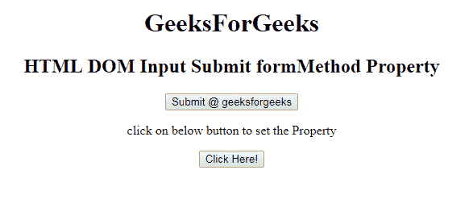

# HTML | DOM 输入提交表单方法属性

> 原文:[https://www . geesforgeks . org/html-DOM-input-submit-form method-property/](https://www.geeksforgeeks.org/html-dom-input-submit-formmethod-property/)

HTML DOM 中的**输入提交表单方法属性**用于设置或返回提交按钮的表单方法属性的值。formMethod 属性用于指定在提交表单时用于发送数据的 HTTP 方法。HTTP 方法有两种，GET 和 POST。该属性覆盖了<表单>元素的方法属性。

**语法:**

*   它返回输入提交表单方法属性。

    ```html
    submitObject.formMethod
    ```

*   它用于设置输入提交表单方法属性。

    ```html
    submitObject.formMethod = get|post
    ```

**属性值:**

*   **GET:** 在 GET 方法中，表单提交后，表单值会在新浏览器选项卡的地址栏中可见。
*   **POST:** 在 POST 方法中，表单提交后，表单值在新浏览器选项卡的地址栏中将不会像在 GET 方法中一样可见。

**返回值:**返回一个字符串值，代表提交表单时发送数据的 HTTP 方法。

**示例 1:** 本示例说明如何返回输入提交表单方法属性。

```html
<!DOCTYPE html> 
<html> 

<head> 
    <title> 
        HTML DOM Input Submit formMethod Property
    </title> 
</head> 

<body style="text-align:center;"> 
    <h1>
        GeeksForGeeks
    </h1>

    <h2> 
        HTML DOM Input Submit formMethod Property 
    </h2> 

    <form action="#" method="get" target="_self">
        <input type = "submit" id = "Geeks" name="myGeeks" 
            value = "Submit @ geeksforgeeks"
            formTarget="_blank" formMethod="post">
    </form>

    <p>
        click on below button to return the Property
    </p>

    <button onclick = "myGeeks()"> 
        Click Here! 
    </button> 

    <p id = "GFG"style="font-size:25px;"></p> 

    <!-- Script to set submit formMethod Property -->
    <script> 
        function myGeeks() { 
            var btn = document.getElementById("Geeks").formMethod;
            document.getElementById("GFG").innerHTML = btn; 
        } 
    </script> 
</body> 

</html>                    
```

**输出:**
**点击按钮前:**

**点击按钮后:**


**示例 2:** 本示例说明如何返回 Input Submit formMethod 属性。

```html
<!DOCTYPE html> 
<html> 

<head> 
    <title> 
        HTML DOM Input Submit formMethod Property
    </title> 
</head> 

<body style="text-align:center;"> 
    <h1>
        GeeksForGeeks
    </h1>

    <h2> 
        HTML DOM Input Submit formMethod Property 
    </h2>

    <form action="#" method="get" target="_self">
        <input type = "submit" id = "Geeks"
            name="myGeeks" value = "Submit @ geeksforgeeks"
            formTarget="_blank" formMethod="post">
    </form>

    <p>
        click on below button to set the Property
    </p>

    <button onclick = "myGeeks()"> 
        Click Here! 
    </button> 

    <p id = "GFG"style="font-size:25px;"></p> 

    <!-- Script to set submit formMethod Property -->
    <script> 
        function myGeeks() { 
            var btn = document.getElementById("Geeks").formMethod
                    = "Get";

            document.getElementById("GFG").innerHTML
                    = "The value of the formMethod attribute"
                      + " was changed to " + btn; 
        } 
    </script> 
</body> 

</html>                    
```

**输出:**
**点击按钮前:**

**点击按钮后:**


**支持的浏览器:**T2 DOM 输入提交表单方法属性支持的浏览器如下:

*   谷歌 Chrome
*   Internet Explorer 10.0
*   火狐浏览器
*   歌剧
*   旅行队