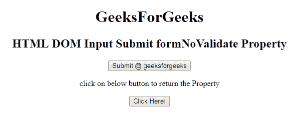

# HTML | DOM 输入提交表单合并属性

> 原文:[https://www . geesforgeks . org/html-DOM-input-submit-formnovalidate-property/](https://www.geeksforgeeks.org/html-dom-input-submit-formnovalidate-property/)

HTML DOM 中的**输入提交表单更新属性**用于设置或返回提交表单时是否应该验证表单数据。此属性用于反映 HTML 表单验证属性。

**语法:**

*   它返回 formNoValidate 属性。

    ```html
    submitObject.formNoValidate
    ```

*   它用于设置 formNoValidate 属性。

    ```html
    submitObject.formNoValidate = true|false
    ```

**属性值:**

*   **true:** 指定表单数据不应该被验证。
*   **false:** 为默认值。它指定应该验证表单数据。

**返回值:**返回一个字符串值，表示提交表单时表单数据是否应该被验证。

**示例 1:** 本示例说明如何返回 Input Submit formNoValidate 属性。

```html
<!DOCTYPE html> 
<html> 

<head> 
    <title> 
        HTML DOM Input Submit formNoValidate Property
    </title> 
</head> 

<body style="text-align:center;"> 
    <h1>
        GeeksForGeeks
    </h1>

    <h2> 
        HTML DOM Input Submit formNoValidate Property 
    </h2> 

    <form action="#" method="get" target="_self">
        <input type = "submit" id = "Geeks" name="myGeeks"
            value = "Submit @ geeksforgeeks"
            formTarget="_blank" Formnovalidate>
    </form>

    <p>
        click on below button to return the Property
    </p>

    <button onclick = "myGeeks()"> 
        Click Here! 
    </button> 

    <p id = "GFG"style="font-size:25px;"></p> 

    <!-- Script to return submit formnovalidate Property -->
    <script> 
        function myGeeks() { 
            var btn = document.getElementById("Geeks").formNoValidate;
            document.getElementById("GFG").innerHTML = btn; 
        } 
    </script> 
</body> 

</html>                    
```

**输出:**
**点击按钮前:**

**点击按钮后:**


**示例 2:** 本示例说明如何设置输入提交表单更新数据属性。

```html
<!DOCTYPE html> 
<html> 

<head> 
    <title> 
        HTML DOM Input Submit formNoValidate Property
    </title> 
</head> 

<body style="text-align:center;"> 
    <h1>
        GeeksForGeeks
    </h1>

    <h2> 
        HTML DOM Input Submit formNoValidate Property 
    </h2> 

    <form action="#" method="get" target="_self">
        <input type = "submit" id = "Geeks" name="myGeeks"
            value = "Submit @ geeksforgeeks"
            formTarget="_blank" Formnovalidate>
    </form>

    <p>
        click on below button to set the Property
    </p>

    <button onclick = "myGeeks()"> 
        Click Here! 
    </button> 

    <p id = "GFG"style="font-size:25px;"></p> 

    <!-- Script to set submit formnovalidate Property -->
    <script> 
        function myGeeks() { 
            var btn = document.getElementById("Geeks").formNoValidate
                    = false;

            document.getElementById("GFG").innerHTML = btn; 
        } 
    </script> 
</body> 

</html>                               
```

**输出:**
**点击按钮前:**

点击按钮后:


**支持的浏览器:**T2 DOM 输入提交表单数据属性支持的浏览器如下:

*   谷歌 Chrome
*   Internet Explorer 10.0
*   火狐浏览器
*   歌剧
*   旅行队