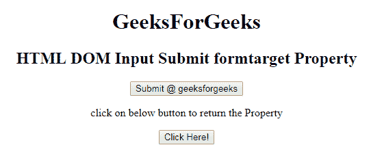
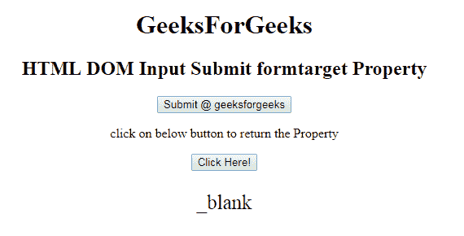
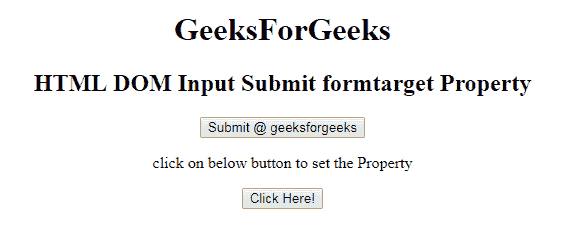
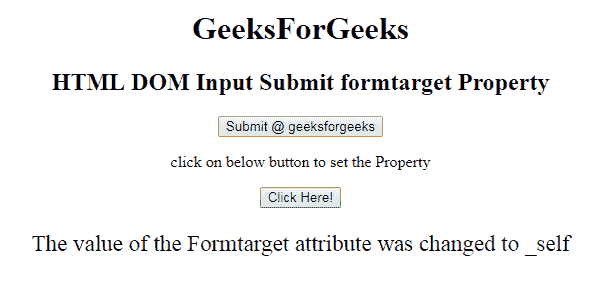

# HTML | DOM 输入提交表单目标属性

> 原文:[https://www . geesforgeks . org/html-DOM-input-submit-formtarget-property/](https://www.geeksforgeeks.org/html-dom-input-submit-formtarget-property/)

HTML DOM 中的**输入提交表单目标属性**用于设置或返回提交字段的表单目标属性的值。目标属性用于指定提交的结果将在当前窗口、新选项卡还是新框架中打开。

**语法:**

*   它用于返回 formTarget 属性。

    ```html
    submitObject.formTarget
    ```

*   它用于设置 formTarget 属性。

    ```html
    submitObject.formTarget = "_blank|_self|_parent|_top|framename"
    ```

**属性值:**

*   **_blank:** 定义提交的结果将在新窗口或新标签中打开。
*   **_self:** 指定提交的结果将在同一窗口打开。
*   **_parent:** 指定结果将在父框架集中打开。
*   **_top:** 它指定结果将在窗口的整个主体中打开。
*   **框架名称:**它在一个命名的框架中打开响应。

**返回值:**返回一个字符串值，代表提交的结果是在当前窗口、新标签还是新框架中打开。

**示例 1:** 本示例说明如何返回 Input Submit formTarget 属性。

```html
<!DOCTYPE html> 
<html> 

<head> 
    <title> 
        HTML DOM Input Submit formTarget Property
    </title> 
</head> 

<body style="text-align:center;"> 
    <h1>
        GeeksForGeeks
    </h1>

    <h2> 
        HTML DOM Input Submit formtarget Property 
    </h2> 

    <form action="#" method="get" target="_self">

        <input type = "submit" id = "Geeks" name="myGeeks"
            value = "Submit @ geeksforgeeks" formTarget="_blank">
    </form>

    <p>
        click on below button to return the Property
    </p>

    <button onclick = "myGeeks()"> 
        Click Here! 
    </button> 

    <p id = "GFG"style="font-size:25px;"></p> 

    <!-- Script to return submit formTarget Property -->
    <script> 
        function myGeeks() { 
            var btn = document.getElementById("Geeks").formTarget;
            document.getElementById("GFG").innerHTML = btn; 
        } 
    </script> 
</body> 

</html>                                
```

**输出:**
**点击按钮前:**

**点击按钮后:**


**示例 2:** 本示例说明如何设置输入提交表单目标属性。

```html
<!DOCTYPE html> 
<html> 

<head> 
    <title> 
        HTML DOM Input Submit formTarget Property
    </title> 
</head> 

<body style="text-align:center;"> 
    <h1>
        GeeksForGeeks
    </h1>

    <h2> 
        HTML DOM Input Submit formtarget Property 
    </h2> 

    <form action="#" method="get" target="_self">
        <input type = "submit" id = "Geeks" name="myGeeks"
        value = "Submit @ geeksforgeeks" formTarget="_blank">
    </form>

    <p>
        click on below button to set the Property
    </p>

    <button onclick = "myGeeks()"> 
        Click Here! 
    </button> 

    <p id = "GFG"style="font-size:23px;"></p> 

    <!-- Script to set submit formTarget Property -->
    <script> 
        function myGeeks() { 
            var btn = document.getElementById("Geeks").formTarget
                    = "_self";

            document.getElementById("GFG").innerHTML 
                    = "The value of the Formtarget attribute"
                      + " was changed to " + btn; 
        } 
    </script> 
</body> 

</html>                    
```

**输出:**
**点击按钮前:**

**点击按钮后:**


**支持的浏览器:**T2 DOM 输入提交表单目标属性支持的浏览器如下:

*   谷歌 Chrome
*   Internet Explorer 10.0
*   火狐浏览器
*   歌剧
*   旅行队