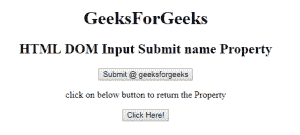
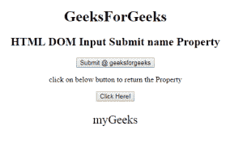
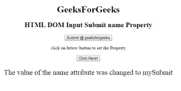

# HTML | DOM 输入提交名称属性

> 原文:[https://www . geesforgeks . org/html-DOM-input-submit-name-property/](https://www.geeksforgeeks.org/html-dom-input-submit-name-property/)

HTML DOM 中的**输入提交名称属性**用于设置或返回提交字段的名称属性值。每个输入字段都需要名称属性。如果没有在输入字段中指定 name 属性，则根本不会发送该字段的数据。

**语法:**

*   它返回输入提交名称属性。

    ```html
    submitObject.name
    ```

*   它用于设置输入提交名称属性。

    ```html
    submitObject.name = name
    ```

**属性值:**它包含定义提交字段名称的单个值名称。

**返回值:**返回代表提交字段名称的字符串值。

**示例 1:** 本示例说明如何返回 Input 提交名称属性。

```html
<!DOCTYPE html> 
<html> 

<head> 
    <title> 
        HTML DOM Input Submit name Property
    </title> 
</head> 

<body style="text-align:center;"> 
    <h1>
        GeeksForGeeks
    </h1>

    <h2> 
        HTML DOM Input Submit name Property 
    </h2> 

    <form id="myGeeks">
        <input type = "submit" id = "Geeks" name="myGeeks"
                value = "Submit @ geeksforgeeks">
    </form>

    <p>
        click on below button to return the Property
    </p>

    <button onclick = "myGeeks()"> 
        Click Here! 
    </button> 

    <p id = "GFG"style="font-size:25px;"></p> 

    <!-- Script to return submit name Property -->
    <script> 
        function myGeeks() { 
            var btn = document.getElementById("Geeks").name; 
            document.getElementById("GFG").innerHTML = btn; 
        } 
    </script> 
</body> 

</html>                                  
```

**输出:**
**点击按钮前:**

**点击按钮后:**


**示例 2:** 本示例说明如何设置输入提交名称属性。

```html
<!DOCTYPE html> 
<html> 

<head> 
    <title> 
        HTML DOM Input Submit name Property
    </title> 
</head> 

<body style="text-align:center;"> 
    <h1>
        GeeksForGeeks
    </h1>

    <h2> 
        HTML DOM Input Submit name Property 
    </h2> 

    <form id="myGeeks">
        <input type = "submit" id = "Geeks" name="myGeeks"
                value = "Submit @ geeksforgeeks">
    </form>

    <p>
        click on below button to set the Property
    </p>

    <button onclick = "myGeeks()"> 
        Click Here! 
    </button> 

    <p id = "GFG"style="font-size:25px;"></p> 

    <!-- Script to set submit name Property -->
    <script> 
        function myGeeks() { 
            var btn = document.getElementById("Geeks").name
                    = "mySubmit";

            document.getElementById("GFG").innerHTML
                    = "The value of the name attribute was"
                      + " changed to " + btn; 
        } 
    </script> 
</body> 

</html>                    
```

**输出:**
**点击按钮前:**

**点击按钮后:**


**支持的浏览器:**T2 DOM 输入提交名称属性支持的浏览器如下:

*   谷歌 Chrome
*   微软公司出品的 web 浏览器
*   火狐浏览器
*   歌剧
*   旅行队