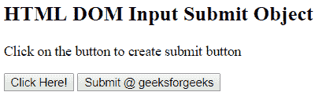

# HTML | DOM 输入提交对象

> 原文:[https://www.geeksforgeeks.org/html-dom-input-submit-object/](https://www.geeksforgeeks.org/html-dom-input-submit-object/)

HTML DOM 中的 Input Submit 对象表示具有 type = "submit "属性的 HTML <input>元素。

**语法:**

*   它创建一个输入提交对象。

    ```html
    document.createElement("INPUT")
    ```

*   它用于访问输入提交对象。

    ```html
    document.getElementById("id")
    ```

**属性值:**

*   **自动对焦:**设置或返回页面加载时提交按钮是否应自动对焦。
*   **默认值:**设置或返回提交按钮的默认值。
*   **禁用:**设置或返回提交按钮是否禁用。
*   **表单:**它返回对包含提交按钮的表单的引用。
*   **formAction:** 设置或返回提交按钮的 formAction 属性的值。
*   **formEnctype:** 设置或返回提交按钮的 formEnctype 属性的值。
*   **formMethod:** 设置或返回提交按钮的 formMethod 属性的值。
*   **表单更新数据:**设置或返回提交按钮是否允许表单数据被验证。
*   **formTarget:** 设置或返回提交按钮的 formTarget 属性的值。
*   **名称:**设置或返回提交按钮名称属性的值。
*   **类型:**返回提交按钮的表单元素类型。
*   **值:**设置或返回提交按钮的值属性的值。

**返回值:**返回对象，对应执行的输入提交动作。

**示例 1:** 本示例创建一个输入提交对象

```html
<!DOCTYPE html>
<html>

<head>
    <title>
        HTML DOM Input Submit Object
    </title>
</head>

<body>

    <h2>
        HTML DOM Input Submit Object
    </h2>

    <p>
        Click on the button to create
        submit button
    </p>

    <button onclick = "myGeeks()">
        Click Here!
    </button>

    <!-- Script to create submit button -->
    <script>
        function myGeeks() {
            var btn = document.createElement("INPUT");
            btn.setAttribute("type", "submit");
            btn.value = ("Submit @ geeksforgeeks");
            document.body.appendChild(btn);
        }
    </script>
</body>

</html>                    
```

**输出:**
**之前点击按钮:**

**之后点击按钮:**


**示例 2:** 该示例描述了输入提交对象的访问

```html
<!DOCTYPE html>
<html>

<head>
    <title>
        HTML DOM Input Submit Object
    </title>
</head>

<body>

    <h2>
        HTML DOM Input Submit Object
    </h2>

    <p>
        Click on the button to create
        submit button
    </p>

    <input type = "submit" id = "Geeks"
            value = "Submit @ geeksforgeeks">

    <button onclick = "myGeeks()">
        Click Here!
    </button>

    <p id = "GFG"></p>

    <!-- Script to create submit button -->
    <script>
        function myGeeks() {
            var btn = document.getElementById("Geeks").value;
            document.getElementById("GFG").innerHTML = btn;
        }
    </script>
</body>

</html>                    
```

**输出:**
**之前点击按钮:**

**之后点击按钮:**


**支持的浏览器:***DOM 输入提交对象*支持的浏览器如下:

*   谷歌 Chrome
*   火狐浏览器
*   微软公司出品的 web 浏览器
*   歌剧
*   旅行队