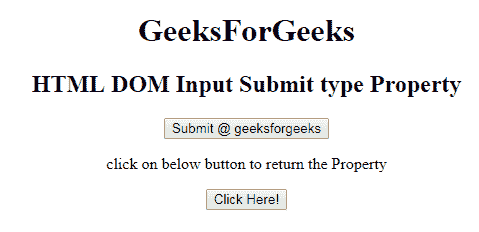
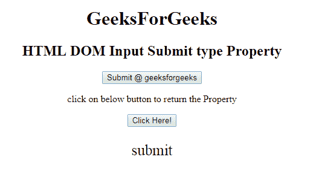

# HTML | DOM 输入提交类型属性

> 原文:[https://www . geesforgeks . org/html-DOM-input-submit-type-property/](https://www.geeksforgeeks.org/html-dom-input-submit-type-property/)

HTML DOM 中的 **DOM 输入提交类型属性**用于返回提交字段的表单元素类型。它总是返回输入提交字段的提交。
**语法:**

```html
submitObject.type
```

**返回值:**它返回一个字符串值，代表输入提交字段的表单元素类型。

下面的程序说明了 HTML DOM 中的提交类型属性:
**示例:本示例返回提交字段的表单元素的类型。**T3】

## 超文本标记语言

```html
<!DOCTYPE html>
<html>

<head>
    <title>
        HTML DOM Input Submit type Property
    </title>
</head>

<body style="text-align:center;">
    <h1>
        GeeksForGeeks
    </h1>
    <h2>
        HTML DOM Input Submit type Property
    </h2>
      <form id="myGeeks">
    <input type = "submit" id = "Geeks"
            value = "Submit @ geeksforgeeks">
            </form>

<p>
           click on below button to return the  Property
       </p>

    <button onclick = "myGeeks()">
        Click Here!
    </button>

    <p id = "GFG"style="font-size:25px;"></p>

    <!-- Script to return submit value Property -->
    <script>
        function myGeeks() {
            var btn = document.getElementById("Geeks").type;
            document.getElementById("GFG").innerHTML = btn;
        }
    </script>
</body>

</html>                    
```

**输出:**
**点击按钮前:**



**点击按钮后:**



**支持的浏览器:**DOM 输入提交类型属性支持的浏览器如下:

*   **谷歌铬**
*   **互联网浏览器**
*   **Firefox**
*   **歌剧**
*   **Safari**