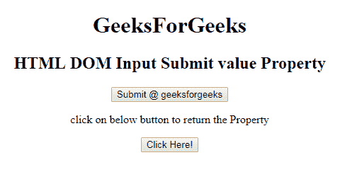
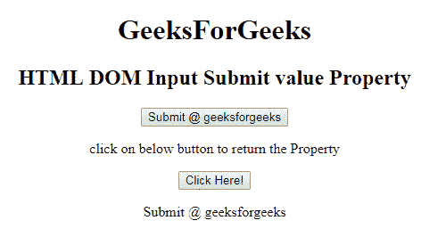
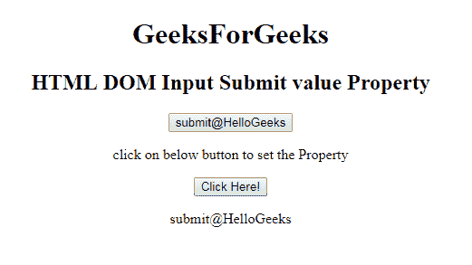

# HTML | DOM 输入提交值属性

> 原文:[https://www . geesforgeks . org/html-DOM-input-submit-value-property/](https://www.geeksforgeeks.org/html-dom-input-submit-value-property/)

HTML DOM 中的 **DOM 输入提交值属性**用于设置或返回输入提交字段的值属性的值。值属性指定提交字段中显示的文本。

**语法:**

*   它返回 value 属性。

    ```html
    submitObject.value
    ```

*   它用于设置 value 属性。

    ```html
    submitObject.value = text
    ```

**属性值:**包含单值文本，定义提交按钮中显示的文本。

**返回值:**返回代表提交按钮中显示的文本的字符串值。

**示例-1:** 本示例说明如何**返回**输入提交值属性。

```html
<!DOCTYPE html> 
<html> 

<head> 
    <title> 
        HTML DOM Input Submit value Property
    </title> 
</head> 

<bodystyle="text-align:center;"> 
    <h1>
        GeeksForGeeks
    </h1>
    <h2> 
        HTML DOM Input Submit value Property 
    </h2> 

    <input type = "submit" id = "Geeks"
            value = "Submit @ geeksforgeeks"> 
       <p>
           click on below button to return the  Property
       </p>
    <button onclick = "myGeeks()"> 
        Click Here! 
    </button> 

    <p id = "GFG"></p> 

    <!-- Script to return submit value Property -->
    <script> 
        function myGeeks() { 
            var btn = document.getElementById("Geeks").value; 
            document.getElementById("GFG").innerHTML = btn; 
        } 
    </script> 
</body> 

</html>                     
```

**输出:**
**点击按钮前:**

**点击按钮后:**


**示例-2:** 本示例说明如何**设置**输入提交值属性。

```html
<!DOCTYPE html> 
<html> 

<head> 
    <title> 
        HTML DOM Input Submit value Property
    </title> 
</head> 

<body style="text-align:center;"> 
    <h1>
        GeeksForGeeks
    </h1>
    <h2> 
        HTML DOM Input Submit value Property 
    </h2> 

    <input type = "submit" id = "Geeks"
            value = "Submit @ geeksforgeeks"> 
       <p>
           click on below button to set the  Property
       </p>
    <button onclick = "myGeeks()"> 
        Click Here! 
    </button> 

    <p id = "GFG"></p> 

    <!-- Script to set submit value Property -->
    <script> 
        function myGeeks() { 
            var btn = document.getElementById("Geeks").value = "submit@HelloGeeks"; 
            document.getElementById("GFG").innerHTML = btn; 
        } 
    </script> 
</body> 

</html>                     
```

**输出:**
**点击按钮前:**

**点击按钮后:**


**支持的浏览器:****DOM 输入提交值属性**支持的浏览器如下:

*   谷歌 Chrome
*   微软公司出品的 web 浏览器
*   火狐浏览器
*   歌剧
*   旅行队