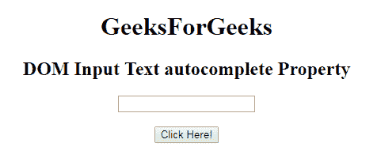
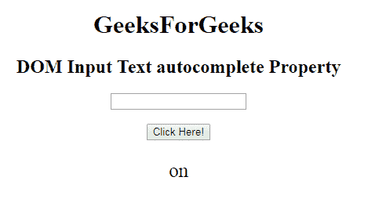
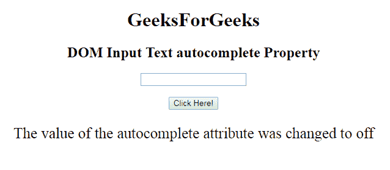

# HTML | DOM 输入文本自动完成属性

> 原文:[https://www . geesforgeks . org/html-DOM-input-text-autocomplete-property/](https://www.geeksforgeeks.org/html-dom-input-text-autocomplete-property/)

HTML DOM 中的 **DOM 输入文本自动完成属性**用于设置或返回输入文本字段的自动完成属性的值。自动完成属性用于指定自动完成属性的值是“开”还是“关”。当浏览器上的自动完成属性设置为时，将自动完成用户之前输入的值。

**语法:**

*   它返回输入文本自动完成属性。

    ```html
    textObject.autocomplete
    ```

*   它用于设置输入文本自动完成属性。

    ```html
    textObject.autocomplete = "on|off"
    ```

**属性值:**包含以下两个值:

*   **开:**为默认值。它会自动完成这些值。
*   **off:** 定义用户填写文本输入字段的值。它不会自动完成这些值。

**返回值:**返回一个代表自动完成状态的字符串值

**示例:**本示例说明了如何**返回**属性。

```html
<!DOCTYPE html> 
<html> 

<head> 
    <title> 
        HTML DOM Input Text autocomplete  Property
    </title> 
</head> 

<body style="text-align:center;"> 

    <h1>GeeksForGeeks</h1> 

    <h2>DOM Input Text autocomplete Property</h2> 
            <form id="myGeeks">
    <input type="text" id="text_id" name="geeks" autocomplete="on"> 
                 </form>
                 <br>
    <button onclick="myGeeks()">Click Here!</button> 

    <p id="GFG" style="font-size:25px;"></p> 

    <!-- script to return the autocomplete  Property-->
    <script> 
        function myGeeks() { 
            var txt = document.getElementById("text_id").autocomplete;
            document.getElementById("GFG").innerHTML = txt;
        } 
    </script> 
</body> 

</html>                     
```

**输出:**
**点击按钮前:**

**点击按钮后:**

**示例-2:** 本示例说明如何**设置**属性。

```html
<!DOCTYPE html> 
<html> 

<head> 
    <title> 
        HTML DOM Input Text autocomplete  Property
    </title> 
</head> 

<body style="text-align:center;"> 

    <h1>GeeksForGeeks</h1> 

    <h2>DOM Input Text autocomplete Property</h2> 
            <form id="myGeeks">
    <input type="text" id="text_id" name="geeks" autocomplete="on"> 
                 </form>
                 <br>
    <button onclick="myGeeks()">Click Here!</button> 

    <p id="GFG" style="font-size:25px;"></p> 

    <!-- script to return the autocomplete  Property-->
    <script> 
        function myGeeks() { 
            var txt = document.getElementById("text_id").autocomplete = "off";
            document.getElementById("GFG").innerHTML = 
          "The value of the autocomplete attribute was changed to " + txt;
        } 
    </script> 
</body> 

</html>                     
```

**输出:**
**点击按钮前:**

**点击按钮后:**


**支持的浏览器:**T2 DOM 输入文本自动完成属性支持的浏览器如下:

*   谷歌 Chrome
*   微软公司出品的 web 浏览器
*   火狐浏览器
*   歌剧
*   旅行队