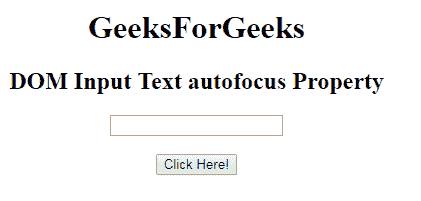
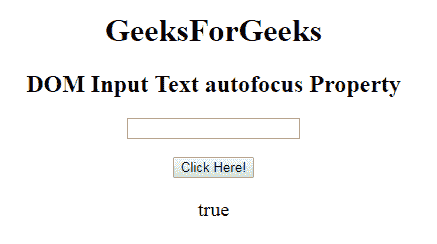
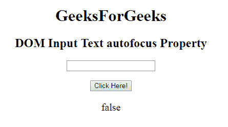

# HTML | DOM 输入文本自动聚焦属性

> 原文:[https://www . geesforgeks . org/html-DOM-input-text-autofocus-property/](https://www.geeksforgeeks.org/html-dom-input-text-autofocus-property/)

HTML DOM 中的 **DOM 输入文本自动聚焦属性**用于设置或返回页面加载时输入文本字段是否应该获得焦点。它反映了 HTML 自动对焦属性。

**语法:**

*   它返回自动对焦属性。

    ```html
    textObject.autofocus
    ```

*   它用于设置自动对焦属性。

    ```html
    textObject.autofocus = "true|false"
    ```

**属性值:**

*   **true:** 设置文本字段的焦点。
*   **假:**有默认值。它定义了文本字段不能获得焦点。

**返回值:**返回一个布尔值，代表文本字段是否自动对焦。

**示例:**本示例返回输入文本自动对焦属性。

```html
<!DOCTYPE html> 
<html> 

<head> 
    <title> 
        HTML DOM Input Text autofocus  Property
    </title> 
</head> 

<body style="text-align:center;"> 

    <h1>GeeksForGeeks</h1> 

    <h2>DOM Input Text autofocus Property</h2> 
            <form id="myGeeks">
    <input type="text" id="text_id" name="geeks" autofocus> 
                 </form>
                 <br>
    <button onclick="myGeeks()">Click Here!</button> 

    <p id="GFG" style="font-size:20px;"></p> 

    <!-- script to return the autofocus  Property-->
    <script> 
        function myGeeks() { 
            var txt = document.getElementById("text_id").autofocus;
            document.getElementById("GFG").innerHTML = txt;
        } 
    </script> 
</body> 

</html>                     
```

**输出**
**点击按钮前:**

**点击按钮后:**

**示例-2:** 本示例说明如何**设置**属性。

```html
<!DOCTYPE html> 
<html> 

<head> 
    <title> 
        HTML DOM Input Text autofocus  Property
    </title> 
</head> 

<body style="text-align:center;"> 

    <h1>GeeksForGeeks</h1> 

    <h2>DOM Input Text autofocus Property</h2> 
            <form id="myGeeks">
    <input type="text" id="text_id" name="geeks" autofocus> 
                 </form>
                 <br>
    <button onclick="myGeeks()">Click Here!</button> 

    <p id="GFG" style="font-size:20px;"></p> 

    <!-- script to set the autofocus  Property-->
    <script> 
        function myGeeks() { 
            var txt = document.getElementById("text_id").autofocus = "false";
            document.getElementById("GFG").innerHTML = txt;
        } 
    </script> 
</body> 

</html>                     
```

**输出:**
**点击按钮前:**

**点击按钮后:**


**支持的浏览器:****DOM 输入文本自动聚焦属性**支持的浏览器如下:

*   谷歌 Chrome
*   微软公司出品的 web 浏览器
*   火狐浏览器
*   歌剧
*   旅行队