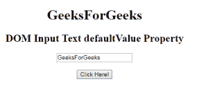
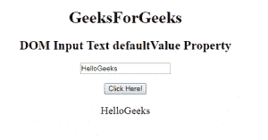

# HTML | DOM 输入文本默认值属性

> 原文:[https://www . geesforgeks . org/html-DOM-input-text-defaultvalue-property/](https://www.geeksforgeeks.org/html-dom-input-text-defaultvalue-property/)

HTML DOM 中的**输入文本默认值属性**用于设置或返回文本字段的默认值。此属性用于反映 HTML 值属性。默认值与值的主要区别在于，默认值表示默认值，值包含一些更改后的当前值。此属性对于确定文本字段是否已被更改非常有用。

**语法:**

*   它返回 defaultValue 属性。

    ```html
    textObject.defaultValue
    ```

*   它用于设置 defaultValue 属性。

    ```html
    textObject.defaultValue = value
    ```

**属性值:**包含单个属性值**值**，定义文本字段的默认值。

**返回值:**返回代表文本字段默认值的字符串值。

**示例 1:** 本示例说明如何返回输入文本默认值属性。

```html
<!DOCTYPE html> 
<html> 

<head> 
    <title> 
        HTML DOM Input Text defaultValue Property
    </title> 
</head> 

<body style="text-align:center;"> 

    <h1>GeeksForGeeks</h1> 

    <h2>DOM Input Text defaultValue Property</h2> 

    <form id="myGeeks">
        <input type="text" id="text_id" name="geeks"
                value="GeeksForGeeks"> 
    </form><br>

    <button onclick="myGeeks()">Click Here!</button> 

    <p id="GFG" style="font-size:20px;"></p> 

    <!-- script to return the defaultValue Property-->
    <script> 
        function myGeeks() { 
            var txt = document.getElementById("text_id").defaultValue;
            document.getElementById("GFG").innerHTML = txt;
        } 
    </script> 
</body> 

</html>                    
```

**输出:**
**点击按钮前:**

**点击按钮后:**


**示例 2:** 本示例说明如何设置输入文本默认值属性。

```html
<!DOCTYPE html> 
<html> 

<head> 
    <title> 
        HTML DOM Input Text defaultValue Property
    </title> 
</head> 

<body style="text-align:center;"> 

    <h1>GeeksForGeeks</h1> 

    <h2>DOM Input Text defaultValue Property</h2> 

    <form id="myGeeks">
        <input type="text" id="text_id" name="geeks"
                value="GeeksForGeeks"> 
    </form><br>

    <button onclick="myGeeks()">Click Here!</button> 

    <p id="GFG" style="font-size:20px;"></p> 

    <!-- script to set the defaultValue Property-->
    <script> 
        function myGeeks() { 
            var txt = document.getElementById("text_id").defaultValue
                    = "HelloGeeks";

            document.getElementById("GFG").innerHTML = txt;
        } 
    </script> 
</body> 

</html>                         
```

**输出:**
**点击按钮前:**

**点击按钮后:**


**支持的浏览器:**T2 DOM 输入文本默认值属性支持的浏览器如下:

*   谷歌 Chrome
*   微软公司出品的 web 浏览器
*   火狐浏览器
*   歌剧
*   旅行队