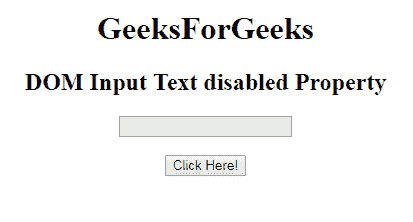
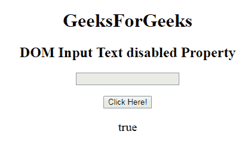
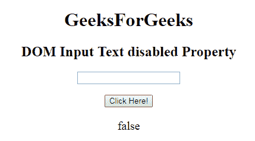

# HTML | DOM 输入文本禁用属性

> 原文:[https://www . geesforgeks . org/html-DOM-input-text-disabled-property/](https://www.geeksforgeeks.org/html-dom-input-text-disabled-property/)

**DOM 输入文本禁用属性**用于设置或返回输入文本字段是否必须禁用**。禁用的文本字段不可点击且不可用。它是一个布尔属性，用于反映 HTML 禁用属性。在所有浏览器中，默认情况下，它通常呈现为灰色。
**语法:**** 

*   **它返回禁用的属性。** 

```html
textObject.disabled
```

*   **它用于设置禁用属性。** 

```html
textObject.disabled = true|false
```

****房产价值:**** 

*   ****真:**定义**输入文本字段**禁用。**
*   ****False:** 有默认值。它定义了**输入文本字段**没有被禁用。**

****返回值:**返回一个布尔值，表示**输入文本字段**是否被禁用。
**例-1:** 本例说明如何归还房产。** 

## **超文本标记语言**

```html
<!DOCTYPE html>
<html>

<head>
    <title>
        HTML DOM Input Text disabled  Property
    </title>
</head>

<body style="text-align:center;">

    <h1>GeeksForGeeks</h1>

    <h2>DOM Input Text disabled Property</h2>
            <form id="myGeeks">
    <input type="text" id="text_id" name="geeks" disabled>
                 </form>
                 <br>
    <button onclick="myGeeks()">Click Here!</button>

    <p id="GFG" style="font-size:20px;"></p>

    <!-- script to return the disabled Property-->
    <script>
        function myGeeks() {
            var txt = document.getElementById("text_id").disabled;
            document.getElementById("GFG").innerHTML = txt;
        }
    </script>
</body>

</html>                    
```

****输出:**
**点击按钮前:**** 

****

****点击按钮后:**** 

****

****示例-2 :** 本示例说明如何**设置**属性。** 

## **超文本标记语言**

```html
<!DOCTYPE html>
<html>

<head>
    <title>
        HTML DOM Input Text disabled  Property
    </title>
</head>

<body style="text-align:center;">

    <h1>GeeksForGeeks</h1>

    <h2>DOM Input Text disabled Property</h2>
            <form id="myGeeks">
    <input type="text" id="text_id" name="geeks" disabled>
                 </form>
                 <br>
    <button onclick="myGeeks()">Click Here!</button>

    <p id="GFG" style="font-size:20px;"></p>

    <!-- script to set the disabled Property-->
    <script>
        function myGeeks() {
            var txt = document.getElementById("text_id").disabled = false;
            document.getElementById("GFG").innerHTML = txt;
        }
    </script>
</body>

</html>                    
```

****输出:**
**点击按钮前:**** 

****

****点击按钮后:**** 

****

****支持的浏览器:****DOM 输入文本禁用属性**支持的浏览器如下:** 

*   **谷歌 Chrome**
*   **微软公司出品的 web 浏览器**
*   **火狐浏览器**
*   **歌剧**
*   **旅行队**