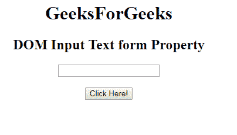
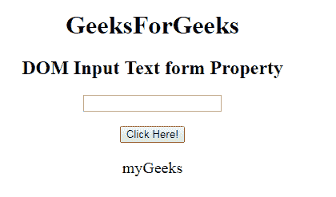

# HTML | DOM 输入文本表单属性

> 原文:[https://www . geesforgeks . org/html-DOM-input-text-form-property/](https://www.geeksforgeeks.org/html-dom-input-text-form-property/)

HTML DOM 中的 **DOM 输入文本表单属性**用于返回包含输入文本字段的表单的引用。它是一个只读属性，在成功时返回表单对象。
**语法:**

```html
textObject.form
```

**返回值**:返回一个字符串值，指定包含输入文本字段的表单的引用。

**示例:**此示例说明了输入文本表单属性。

## 超文本标记语言

```html
<!DOCTYPE html>
<html>

<head>
    <title>
        HTML DOM Input Text form  Property
    </title>
</head>

<body style="text-align:center;">

    <h1>GeeksForGeeks</h1>

    <h2>DOM Input Text form Property</h2>
            <form id="myGeeks">
    <input type="text" id="text_id" name="geeks" maxlength="60">
                 </form>
                 <br>
    <button onclick="myGeeks()">Click Here!</button>

    <p id="GFG" style="font-size:20px;"></p>

    <!-- script to set the form Property-->
    <script>
        function myGeeks() {
            var txt = document.getElementById("text_id").form.id;
            document.getElementById("GFG").innerHTML = txt;
        }
    </script>
</body>

</html>                    
```

**输出:**
**点击按钮前:**



**点击按钮后:**



**支持的浏览器:**T2 DOM 输入文本表单属性支持的浏览器如下:

*   谷歌 Chrome
*   微软公司出品的 web 浏览器
*   火狐浏览器
*   歌剧
*   旅行队