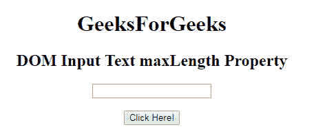
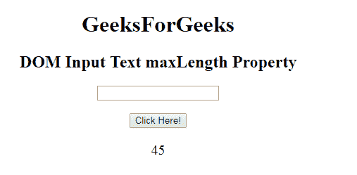
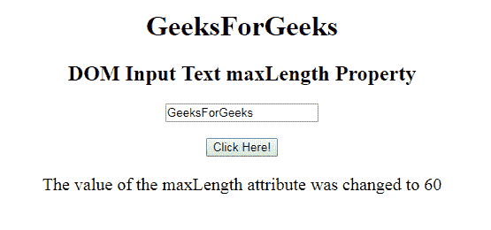

# HTML | DOM 输入文本最大长度属性

> 原文:[https://www . geesforgeks . org/html-DOM-input-text-maxlength-property/](https://www.geeksforgeeks.org/html-dom-input-text-maxlength-property/)

HTML DOM 中的 **DOM 输入文本最大长度属性**用于设置或返回文本输入字段的最大长度属性值。它指定文本字段中允许的最大字符数。输入电子邮件最大长度属性的默认值为 524288。

**语法:**

*   它返回输入文本最大长度属性。

    ```html
    textObject.maxLength
    ```

    *   It is used to set the Input text maxLength property.

    ```html
    textObject.maxLength = number
    ```

    **属性值:**它包含单个数值，用于指定文本最大长度字段中允许的最大字符数。

    **返回值:**返回一个数值，代表文本最大长度字段中允许的最大字符数。

    **示例 1:** 本示例说明如何**返回**输入文本最大长度属性。

    ```html
    <!DOCTYPE html> 
    <html> 

    <head> 
        <title> 
            HTML DOM Input Text maxLength Property
        </title> 
    </head> 

    <body style="text-align:center;"> 

        <h1>GeeksForGeeks</h1> 

        <h2>DOM Input Text maxLength Property</h2> 
         <form id="myGeeks">
          <input type="text" id="text_id" 
               name="geeks" pattern="[A-Za-z]{3}"> 
          </form>
                     <br>
        <button onclick="myGeeks()">Click Here!</button> 

        <p id="GFG" style="font-size:20px;"></p> 

        <!-- Script to set the maxLength Property-->
        <script> 
            function myGeeks() { 
                var txt = document.getElementById("text_id").maxLength;
                document.getElementById("GFG").innerHTML = txt;
            } 
        </script> 
    </body> 

    </html>                     
    ```

    **输出:**

    **点击按钮前:**
    
    **点击按钮后:**
    
    **示例-2 :** 本示例说明如何**设置**属性。

    ```html
    <!DOCTYPE html> 
    <html> 

    <head> 
        <title> 
            HTML DOM Input Text maxLength Property
        </title> 
    </head> 

    <body style="text-align:center;"> 

        <h1>GeeksForGeeks</h1> 

        <h2>DOM Input Text maxLength Property</h2> 
                <form id="myGeeks">
        <input type="text" id="text_id" name="geeks" maxlength="60"> 
                     </form>
                     <br>
        <button onclick="myGeeks()">Click Here!</button> 

        <p id="GFG" style="font-size:20px;"></p> 

        <!-- script to set the maxLength Property-->
        <script> 
            function myGeeks() { 
                var txt = document.getElementById("text_id").maxLength;
                document.getElementById("GFG").innerHTML = 
            "The value of the maxLength attribute was changed to " + txt;
            } 
        </script> 
    </body> 

    </html>                     
    ```

    **输出:**
    **点击按钮前:**
    
    **点击按钮后:**
    

    **支持的浏览器:**T2 DOM 输入文本最大长度属性支持的浏览器如下:

    *   谷歌 Chrome
    *   微软公司出品的 web 浏览器
    *   火狐浏览器
    *   歌剧
    *   旅行队