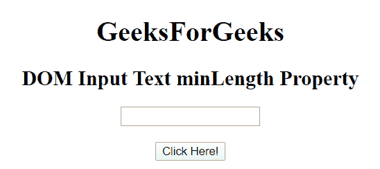
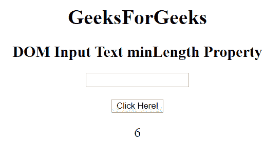
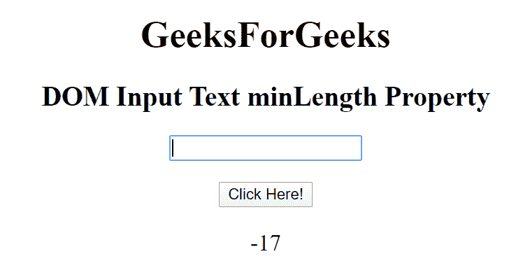

# HTML | DOM 输入文本最小长度属性

> 原文:[https://www . geesforgeks . org/html-DOM-input-text-min length-property/](https://www.geeksforgeeks.org/html-dom-input-text-minlength-property/)

HTML DOM 中的 **HTML DOM 输入文本最小长度属性**用于设置或返回文本输入字段的最小长度属性值。它指定文本字段中允许的最小字符数。输入电子邮件最小长度属性的默认值是 524288。

**语法:**

*   它返回输入文本最小长度属性。

    ```html
    textObject.minLength
    ```

*   它用于设置输入文本最小长度属性。

    ```html
    textObject.minLength = number
    ```

**属性值:**它包含单个数值，用于指定文本最大长度字段中允许的最小字符数。

**返回值:**返回一个数值，代表文本最大长度字段中允许的最大字符数。

**示例 1:** 本示例返回输入文本最小长度属性。

```html
<!DOCTYPE html>
<html>

<head>
    <title>
        HTML DOM Input Text minLength Property
    </title>
</head>

<body style="text-align:center;">

    <h1>GeeksForGeeks</h1>

    <h2>DOM Input Text minLength Property</h2>
    <form id="myGeeks">
        <input type="text" id="text_id" minlength="6"
            name="geeks" pattern="[A-Za-z]{3}">
    </form>
    <br>

    <button onclick="myGeeks()">Click Here!</button>

    <p id="GFG" style="font-size:20px;"></p>

    <!-- Script to set the minLength Property-->
    <script>
        function myGeeks() {
            var txt = document.getElementById(
                    "text_id").minLength;

            document.getElementById(
                    "GFG").innerHTML = txt;
        } 
    </script>
</body>

</html>
```

**输出:**

*   **点击按钮前:**
    
*   **点击按钮后:**
    

**示例 2:** 本示例说明如何设置输入文本最小长度属性。

```html
<!DOCTYPE html>
<html>

<head>
    <title>
        HTML DOM Input Text minLength Property
    </title>
</head>

<body style="text-align:center;">

    <h1>GeeksForGeeks</h1>

    <h2>DOM Input Text minLength Property</h2>
    <form id="myGeeks">
        <input type="text" id="text_id" minlength="6"
            name="geeks" pattern="[A-Za-z]{3}">
    </form>
    <br>

    <button onclick="myGeeks()">Click Here!</button>

    <p id="GFG" style="font-size:20px;"></p>

    <!-- Script to set the minLength Property-->
    <script>
        function myGeeks() {
            var txt = document.getElementById(
                    "text_id").minLength - "23";

            document.getElementById(
                    "GFG").innerHTML = txt;
        } 
    </script>
</body>

</html>
```

**输出:**

*   **点击按钮前:**
    
*   **点击按钮后:**
    

**支持的浏览器:**T2 DOM 输入文本最小长度属性支持的浏览器如下:

*   谷歌 Chrome
*   微软公司出品的 web 浏览器
*   火狐浏览器
*   苹果 Safari
*   歌剧