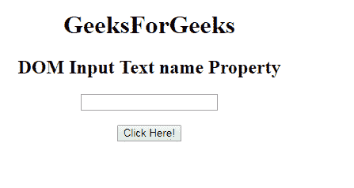
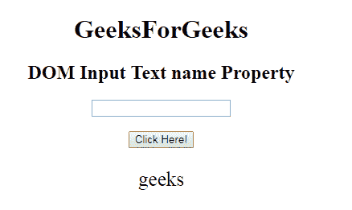
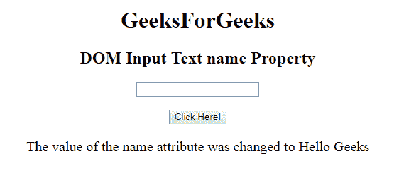

# HTML | DOM 输入文本名称属性

> 原文:[https://www . geesforgeks . org/html-DOM-input-text-name-property/](https://www.geeksforgeeks.org/html-dom-input-text-name-property/)

HTML DOM 中的 **DOM 输入文本名称属性**用于设置或返回文本字段的名称属性值。每个输入字段都需要名称属性。如果没有在输入字段中指定 name 属性，则根本不会发送该字段的数据。

**语法:**

*   它返回输入文本名称属性。

    ```html
    textObject.name
    ```

*   它用于设置输入文本名称属性。

    ```html
    textObject.name = name
    ```

**属性值:**它包含定义文本字段名称的单个值名称。

**返回值:**返回代表文本字段名称的字符串值。

**示例 1:** 本示例说明如何返回 Input 文本名称属性。

```html
<!DOCTYPE html> 
<html> 

<head> 
    <title> 
        HTML DOM Input Text name Property
    </title> 
</head> 

<body style="text-align:center;"> 

    <h1>GeeksForGeeks</h1> 

    <h2>DOM Input Text name Property</h2> 
            <form id="myGeeks">
    <input type="text" id="text_id" name="geeks"
     pattern="[A-Za-z]{3}"> 
                 </form>
                 <br>
    <button onclick="myGeeks()">Click Here!</button> 

    <p id="GFG" style="font-size:25px;"></p> 

    <!-- Script to return the name property-->
    <script> 
        function myGeeks() { 
            var txt = document.getElementById("text_id").name;
            document.getElementById("GFG").innerHTML = txt; 
        } 
    </script> 
</body> 

</html>                     
```

**输出:**
**点击按钮前:**

**点击按钮后:**

**示例-2 :** 本示例说明如何**设置**属性。

```html
<!DOCTYPE html> 
<html> 

<head> 
    <title> 
        HTML DOM Input Text name Property
    </title> 
</head> 

<body style="text-align:center;"> 

    <h1>GeeksForGeeks</h1> 

    <h2>DOM Input Text name Property</h2> 
            <form id="myGeeks">
    <input type="text" id="text_id" name="geeks" 
    pattern="[A-Za-z]{3}"> 
            </form>
    <br>
    <button onclick="myGeeks()">Click Here!</button> 

    <p id="GFG" style="font-size:20px;"></p> 

    <!-- Script to set the name Property-->
    <script> 
        function myGeeks() { 
            var txt = document.getElementById("text_id").name ="Hello Geeks";
            document.getElementById("GFG").innerHTML = 
           "The value of the name attribute was changed to " + txt; 
        } 
    </script> 
</body> 

</html>                     
```

**输出:**
**点击按钮前:**

**点击按钮后:**


**支持的浏览器:****DOM 输入文本名称属性**支持的浏览器如下:

*   谷歌 Chrome
*   微软公司出品的 web 浏览器
*   火狐浏览器
*   歌剧
*   旅行队