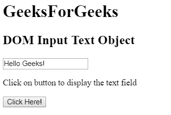
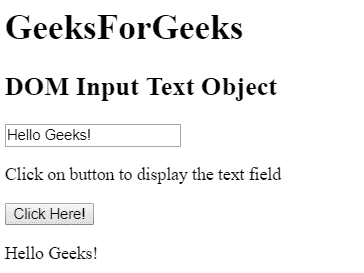
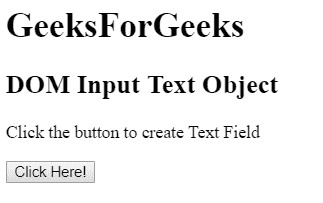
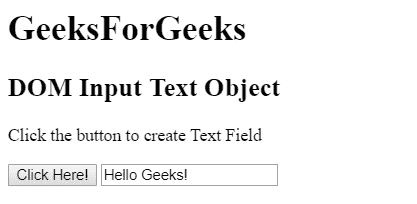

# HTML | DOM 输入文本对象

> 原文:[https://www.geeksforgeeks.org/html-dom-input-text-object/](https://www.geeksforgeeks.org/html-dom-input-text-object/)

HTML DOM 中的**输入文本对象**用于表示带有 *type="text"* 属性的 HTML <输入>元素。使用 getElementById()方法可以访问带有 *type="text"* 的<输入>元素。

**语法:**

*   它用于访问输入文本对象。

```html
document.getElementById("id");
```

*   它用于创建输入元素。

```html
document.createElement("input");
```

**输入文本对象属性:**

<figure class="table">

| attribute | describe |
| type | Used to return the type of form element to the text field. |
| value | This property is used to set or return the value of the value property of a text field. |
| Automatic completion | This property is used to set or return the value of the autocomplete property of a text field. |
| auto-focusing | This property is used to set or return whether the text field should be autofocused when the page is loaded. |
| default | This property is used to set or return the default value of a text field. |
| forbidden | This property is used to set or return whether the text field is disabled. |
| sheet/form | This property is used to return a reference to a form that contains a text field. |
| tabulation/listing | This property is used to return a reference to a data list containing a text field. |
| 最大长 | This property is used to set or return the value of the maxLength property of a text field. |
| name | This property is used to set or return the value of the name property of a text field. |
| model | This property is used to set or return the value of the mode property of the text field. |
| placeholder | This property is used to set or return the value of the placeholder property of a text field. |
| read only | This property is used to set or return whether the text field is read-only. |
| Required | This property is used to set or return whether the text field must be filled in before submitting the form. |
| size | This property is used to set or return the value of the size property of a text field. |

</figure>

**示例 1:** 本示例使用 getElementById()方法访问<输入具有 type="text "属性的>元素。

## 超文本标记语言

```html
<!DOCTYPE html>
<html>

<head>
    <title>
        HTML DOM Input Text Object
    </title>
</head>  

<body>

    <h1>GeeksForGeeks</h1>

    <h2>DOM Input Text Object</h2>

    <input type="text" id="text_id" value="Hello Geeks!">

<p>Click on button to display the text field</p>

    <button onclick="myGeeks()">Click Here!</button>

    <p id="GFG"></p>

    <!-- script to access text field -->
    <script>
        function myGeeks() {
            var txt = document.getElementById("text_id").value;
            document.getElementById("GFG").innerHTML = txt;
        }
    </script>
</body>

</html>                   
```

**输出:**
**之前点击按钮:**



**点击按钮后:**



**示例 2:** 本示例使用 document.createElement()方法创建具有 type="text "属性的<输入>元素。

## 超文本标记语言

```html
<!DOCTYPE html>
<html>

<head>
    <title>
        HTML DOM Input Text Object
    </title>
</head>  

<body>

    <h1>GeeksForGeeks</h1>

    <h2>DOM Input Text Object</h2>

<p>Click the button to create Text Field</p>

    <button onclick = "myGeeks()">
        Click Here!
    </button>

    <!-- script to create th element -->
    <script>
        function myGeeks() {

            /* Create an input element */
            var x = document.createElement("INPUT");

            /* Set the type attribute */
            x.setAttribute("type", "text");

            /* Set the value to the attribute */
            x.setAttribute("value", "Hello Geeks!");

            /* Append node to the body */
            document.body.appendChild(x);
        }
    </script>

</body>
</html>                   
```

**输出:**
**之前点击按钮:**



**点击按钮后:**



**支持的浏览器:**

*   谷歌 Chrome
*   边缘
*   Mozilla Firefox
*   歌剧
*   旅行队