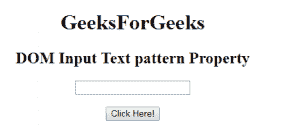
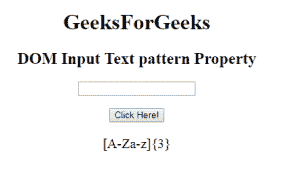

# HTML | DOM 输入文本模式属性

> 原文:[https://www . geesforgeks . org/html-DOM-input-text-pattern-property/](https://www.geeksforgeeks.org/html-dom-input-text-pattern-property/)

HTML DOM 中的**输入文本模式属性**用于设置或返回文本字段的模式属性。它用于指定检查输入元素值的正则表达式。使用全局标题属性来描述帮助用户的模式。

**语法:**

*   它返回输入文本模式属性。

    ```html
    textObject.pattern
    ```

*   它用于设置输入文本模式属性。

    ```html
    textObject.pattern = regexp
    ```

**属性值:**它包含单值正则表达式，用于指定检查文本字段值所依据的正则表达式。

**返回值:**它返回一个字符串值，该值代表检查文本字段值所依据的正则表达式。

**示例:**该示例说明了输入文本模式属性的使用。

```html
<!DOCTYPE html> 
<html> 

<head> 
    <title> 
        HTML DOM Input Text Pattern Property
    </title> 
</head> 

<body style="text-align:center;"> 

    <h1>GeeksForGeeks</h1> 

    <h2>DOM Input Text pattern Property</h2> 

    <form id="myGeeks">
        <input type="text" id="text_id" pattern="[A-Za-z]{3}"> 
    </form>

    <br><br>

    <button onclick="myGeeks()">Click Here!</button> 

    <p id="GFG" style="font-size:20px;"></p> 

    <!-- script to return the pattern Property-->
    <script> 
        function myGeeks() { 
            var txt = document.getElementById("text_id").pattern;
            document.getElementById("GFG").innerHTML = txt; 
        } 
    </script> 
</body> 

</html>                    
```

**输出:**
**点击按钮前:**

**点击按钮后:**


**支持的浏览器:****DOM 输入文本模式属性**支持的浏览器如下:

*   谷歌 Chrome
*   微软公司出品的 web 浏览器
*   火狐浏览器
*   歌剧
*   旅行队