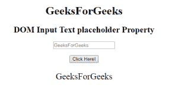

# HTML | DOM 输入文本占位符属性

> 原文:[https://www . geesforgeks . org/html-DOM-input-text-placeholder-property/](https://www.geeksforgeeks.org/html-dom-input-text-placeholder-property/)

HTML DOM 中的**输入文本占位符属性**用于设置或返回文本字段的占位符属性值。占位符属性指定描述输入字段预期值的简短提示。在用户输入值之前，短提示会显示在字段中。
**语法:**

*   它返回输入文本占位符属性。

```html
textObject.placeholder

```

*   它用于设置“输入文本占位符”属性。

```html
textObject.placeholder = text

```

**属性值:**它包含单个值**文本**，用于定义描述文本字段预期值的简短提示。
**返回值:**它返回一个字符串值，该值表示描述文本字段预期值的简短提示。

**示例 1:** 本示例说明如何返回输入文本占位符属性。

## 超文本标记语言

```html
<!DOCTYPE html>
<html>

<head>
    <title>
        HTML DOM Input Text Placeholder Property
    </title>
</head>

<body style="text-align:center;">

    <h1>GeeksForGeeks</h1>

    <h2>DOM Input Text placeholder Property</h2>

    <input type="text" id="text_id" placeholder="GeeksForGeeks">

    <br><br>

    <button onclick="myGeeks()">Click Here!</button>

    <p id="GFG" style="font-size:25px;"></p>

    <!-- script to return the placeholder Property-->
    <script>
        function myGeeks() {
            var txt = document.getElementById("text_id").placeholder;
            document.getElementById("GFG").innerHTML = txt;
        }
    </script>
</body>

</html>                   
```

**输出:**
**点击按钮前:**


**点击按钮后:**



**示例 2:** 本示例说明如何设置输入文本占位符属性。

## 超文本标记语言

```html
<!DOCTYPE html>
<html>

<head>
    <title>
        HTML DOM Input Text Placeholder Property
    </title>
</head>

<body style="text-align:center;">

    <h1>GeeksForGeeks</h1>

    <h2>DOM Input Text placeholder Property</h2>

    <input type="text" id="text_id" placeholder="GeeksForGeeks">

    <br><br>

    <button onclick="myGeeks()">Click Here!</button>

    <p id="GFG" style="font-size:20px;"></p>

    <!-- script to set the placeholder Property-->
    <script>
        function myGeeks() {
            var txt = document.getElementById("text_id").placeholder
                    = "HelloGeeks";

            document.getElementById("GFG").innerHTML
                    = "The value of the placeholder attribute "
                      + "was changed to " + txt;
        }
    </script>
</body>

</html>                   
```

**输出:**
**点击按钮前:**


**点击按钮后:**


**支持的浏览器:****DOM 输入文本占位符属性**支持的浏览器如下:

*   谷歌 Chrome
*   Internet Explorer 10.0
*   火狐浏览器
*   歌剧
*   旅行队