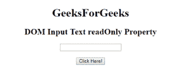
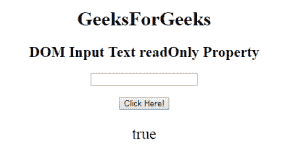
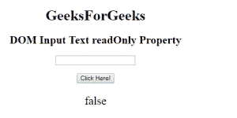

# HTML | DOM 输入文本只读属性

> 原文:[https://www . geesforgeks . org/html-DOM-input-text-readonly-property/](https://www.geeksforgeeks.org/html-dom-input-text-readonly-property/)

HTML DOM 中的**输入文本只读属性**用于设置或返回文本字段是否为只读。这意味着用户不能修改或更改特定元素中已经存在的内容(但是，用户可以定位到它，突出显示它，并从中复制文本)，而 JavaScript 可以用于更改只读值并使输入字段可编辑。

**语法:**

*   它返回 readOnly 属性。

```html
textObject.readOnly

```

*   它用于设置只读属性。

```html
textObject.readOnly = true|false

```

**属性值:**它接受下面列出的两个值:

*   **true:** 定义文本字段为只读。
*   **false:** 为默认值。它定义文本字段不是只读的。

**返回值:**返回一个布尔值，表示文本字段是否为只读。

**示例 1:** 本示例说明如何返回输入文本只读属性。

## 超文本标记语言

```html
<!DOCTYPE html> 
<html> 

<head> 
    <title> 
        HTML DOM Input Text readOnly Property
    </title> 
</head> 

<body style="text-align:center;"> 

    <h1>GeeksForGeeks</h1> 

    <h2>DOM Input Text readOnly Property</h2> 

    <form id="myGeeks">
        <input type="text" id="text_id" readonly> 
    </form><br>

    <button onclick="myGeeks()">Click Here!</button> 

    <p id="GFG" style="font-size:25px;"></p>

    <!-- script to return the readOnly Property-->
    <script> 
        function myGeeks() { 
            var txt = document.getElementById("text_id").readOnly; 
            document.getElementById("GFG").innerHTML = txt; 
        } 
    </script> 
</body> 

</html>                    
```

**输出:**
**点击按钮前:**



**点击按钮后:**



**示例 2:** 本示例说明如何设置输入文本只读属性。

## 超文本标记语言

```html
<!DOCTYPE html> 
<html> 

<head> 
    <title> 
        HTML DOM Input Text readOnly Property
    </title> 
</head> 

<body style="text-align:center;"> 

    <h1>GeeksForGeeks</h1> 

    <h2>DOM Input Text readOnly Property</h2> 

    <form id="myGeeks">
        <input type="text" id="text_id" readonly> 
    </form><br>

    <button onclick="myGeeks()">Click Here!</button> 

    <p id="GFG" style="font-size:25px;"></p>

    <!-- script to set the readOnly Property-->
    <script> 
        function myGeeks() { 
            var txt = document.getElementById("text_id").readOnly
                    = false; 

            document.getElementById("GFG").innerHTML = txt; 
        } 
    </script> 
</body> 

</html>                    
```

**输出:**
**点击按钮前:**


**点击按钮后:**



**支持的浏览器:**T2 DOM 输入文本只读属性支持的浏览器如下:

*   谷歌 Chrome
*   微软公司出品的 web 浏览器
*   火狐浏览器
*   歌剧
*   旅行队