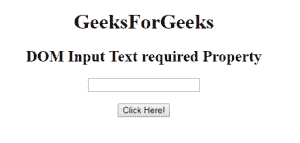
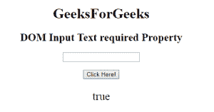
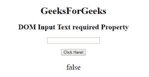

# HTML | DOM 输入文本必需属性

> 原文:[https://www . geesforgeks . org/html-DOM-input-text-required-property/](https://www.geeksforgeeks.org/html-dom-input-text-required-property/)

HTML DOM 中的**需要输入文本属性**用于设置或返回提交表单时是否需要填写输入文本字段。此属性用于反映 HTML 必需的属性。

**语法:**

*   它返回需要输入文本的属性。

    ```html
    textObject.required
    ```

*   它用于设置需要输入文本的属性。

    ```html
    textObject.required = true|false
    ```

**属性值:**

*   **true:** 指定提交表单前必须填写文本字段。
*   **false:** 为默认值。它指定在提交表单之前不得填写文本字段。

**返回值:**返回一个布尔值，表示在提交表单之前是否必须填写文本字段。

**示例 1:** 本示例说明如何返回 Input text required 属性。

```html
<!DOCTYPE html> 
<html> 

<head> 
    <title> 
        HTML DOM Input Text required Property
    </title> 
</head> 

<body style="text-align:center;"> 

    <h1>GeeksForGeeks</h1> 

    <h2>DOM Input Text required Property</h2> 

    <form id="myGeeks">
        <input type="text" id="text_id" required> 
    </form>

    <br><br>

    <button onclick="myGeeks()">Click Here!</button> 

    <p id="GFG" style="font-size:25px;"></p> 

    <!-- script to return the required Property-->
    <script> 
        function myGeeks() { 
            var txt = document.getElementById("text_id").required; 
            document.getElementById("GFG").innerHTML = txt; 
        } 
    </script> 
</body> 

</html>                    
```

**输出:**
**点击按钮前:**

**点击按钮后:**


**示例 2:** 本示例说明如何返回输入文本所需的属性。

```html
<!DOCTYPE html> 
<html> 

<head> 
    <title> 
        HTML DOM Input Text required Property
    </title> 
</head> 

<body style="text-align:center;"> 

    <h1>GeeksForGeeks</h1> 

    <h2>DOM Input Text required Property</h2> 

    <form id="myGeeks">
        <input type="text" id="text_id" required> 
    </form>

    <br><br>

    <button onclick="myGeeks()">Click Here!</button> 

    <p id="GFG" style="font-size:25px;"></p> 

    <!-- script to return the required Property-->
    <script> 
        function myGeeks() { 
            var txt = document.getElementById("text_id").required
                    = false; 

            document.getElementById("GFG").innerHTML = txt; 
        } 
    </script> 
</body> 

</html>                    
```

**输出:**
**点击按钮前:**

**点击按钮后:**


**支持的浏览器:****DOM 输入文本必需属性**支持的浏览器如下:

*   谷歌 Chrome
*   微软公司出品的 web 浏览器
*   火狐浏览器
*   歌剧
*   旅行队