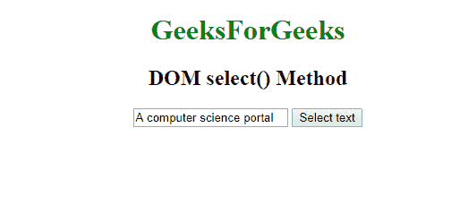
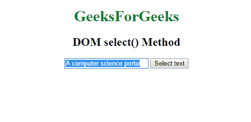

# HTML | DOM 输入文本选择()方法

> 原文:[https://www . geesforgeks . org/html-DOM-input-text-select-method/](https://www.geeksforgeeks.org/html-dom-input-text-select-method/)

**DOM Input select()方法**选择包含文本字段的**文本区域**或**输入**元素的所有文本内容。

**语法:**

```html
element.select();
```

**参数:**该方法不接受任何参数。

**示例:**本示例选择输入文本字段的内容。

```html
<!DOCTYPE html>
<html>

<head>
    <title>HTML DOM focus() Method</title>
</head>

<body>
    <center>
        <h1 style="color:green;"> 
            GeeksForGeeks 
        </h1>

        <h2>DOM select() Method</h2>

        <input type="text" id="text-box" size="20"
                value="A computer science portal">

        <button onclick="selectText()">
            Select text
        </button>

        <script>
            function selectText() {
                const content = 
                    document.getElementById('text-box');

                content.select();
            }
        </script>
    </center>
</body>

</html>
```

**输出:**

*   **点击按钮前:**
    
*   **点击按钮后:**
    

**支持的浏览器:****HTML DOM 输入文本选择()方法**支持的浏览器如下:

*   谷歌 Chrome
*   微软公司出品的 web 浏览器
*   火狐浏览器
*   苹果 Safari
*   歌剧