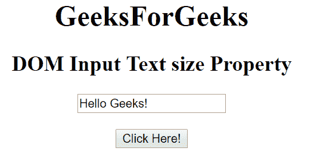
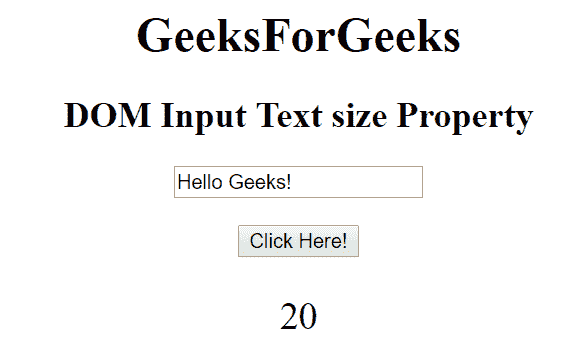
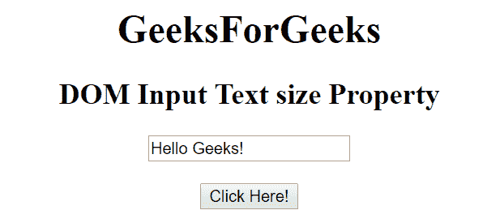
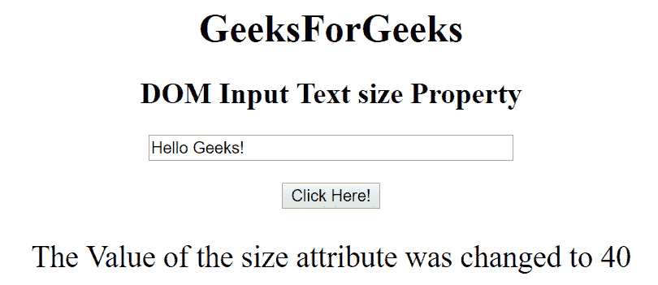

# HTML | DOM 输入文本大小属性

> 原文:[https://www . geesforgeks . org/html-DOM-input-text-size-property/](https://www.geeksforgeeks.org/html-dom-input-text-size-property/)

HTML DOM 中的**输入文本大小属性**用于设置或返回输入文本字段的大小属性值。size 属性用于定义文本字段的宽度。它的默认值是 20。

**语法:**

*   它返回输入文本大小属性。

    ```html
    textObject.size
    ```

*   它用于设置输入文本大小属性。

    ```html
    textObject.size = number
    ```

**属性值:**它包含单个值**数字**，用于根据字符数指定文本字段的宽度。

**返回值:**返回代表字符数的文本字段宽度的数值。

**示例 1:** 本示例说明如何返回 Input 文本大小属性。

```html
<!DOCTYPE html> 
<html> 

<head> 
    <title> 
        HTML DOM Input Text size Property
    </title> 
</head> 

<body style="text-align:center;"> 

    <h1>GeeksForGeeks</h1> 

    <h2>DOM Input Text size Property</h2> 

    <form id="myGeeks">
        <input type="text" id="text_id" 
            value="Hello Geeks!" size="20"> 
    </form>
    <br>

    <button onclick="myGeeks()">Click Here!</button> 

    <p id="GFG" style="font-size:25px;"></p> 

    <!-- Script to return the Input Text size Property-->
    <script> 
        function myGeeks() { 
            var txt = document.getElementById("text_id").size; 
            document.getElementById("GFG").innerHTML = txt; 
        } 
    </script> 
</body> 

</html>                    
```

**输出:**
**点击按钮前:**

**点击按钮后:**


**例 2:** 本例说明如何**设置**属性。

```html
<!DOCTYPE html> 
<html> 

<head> 
    <title> 
        HTML DOM Input Text size Property
    </title> 
</head> 

<body style="text-align:center;"> 

    <h1>GeeksForGeeks</h1> 

    <h2>DOM Input Text size Property</h2> 

    <form id="myGeeks">
        <input type="text" id="text_id" 
            value="Hello Geeks!" size="20"> 
    </form>

    <br>

    <button onclick="myGeeks()">Click Here!</button> 

    <p id="GFG" style="font-size:25px;"></p> 

    <!-- Script to set the Input Text size Property-->
    <script> 
        function myGeeks() { 
            var txt = document.getElementById("text_id").size
                    = "40"; 
            document.getElementById("GFG").innerHTML
                    = "The Value of the size attribute was "
                      + "changed to " + txt; 
        } 
    </script> 
</body> 

</html>                    
```

**输出:**
**点击按钮前:**

**点击按钮后:**


**支持的浏览器:****DOM 输入文本大小属性**支持的浏览器如下:

*   谷歌 Chrome
*   微软公司出品的 web 浏览器
*   火狐浏览器
*   歌剧
*   旅行队