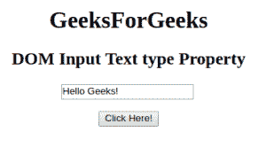
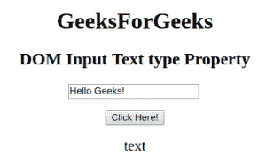

# HTML | DOM 输入文本类型属性

> 原文:[https://www . geesforgeks . org/html-DOM-input-text-type-property/](https://www.geeksforgeeks.org/html-dom-input-text-type-property/)

HTML DOM 中的**输入文本类型属性**用于返回文本字段的表单元素类型。它总是返回输入文本字段的文本。
**语法:**

```html
textObject.type
```

**返回值:**返回一个字符串值，代表输入文本字段的表单元素类型。

下面的程序说明了 HTML DOM 中的文本类型属性:
**示例:**本示例返回文本字段的表单元素的类型。

## 超文本标记语言

```html
<!DOCTYPE html>
<html>

<head>
    <title>
        HTML DOM Input Text type Property
    </title>
</head>

<body style="text-align:center;">

    <h1>GeeksForGeeks</h1>

    <h2>DOM Input Text type Property</h2>

    <input type="text" id="text_id" value="Hello Geeks!">

    <br><br>

    <button onclick="myGeeks()">
        Click Here!
    </button>

    <p id="GFG" style="font-size:20px;"></p>

    <!-- script to return the type Property-->
    <script>
        function myGeeks() {
            var txt = document.getElementById("text_id").type;
            document.getElementById("GFG").innerHTML = txt;
        }
    </script>
</body>

</html>                   
```

**输出:**
**点击按钮前:**



**点击按钮后:**



**支持的浏览器:**T2 DOM 输入文本类型属性支持的浏览器如下:

*   谷歌 Chrome
*   微软公司出品的 web 浏览器
*   火狐浏览器
*   歌剧
*   旅行队