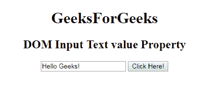
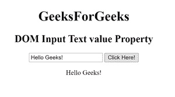
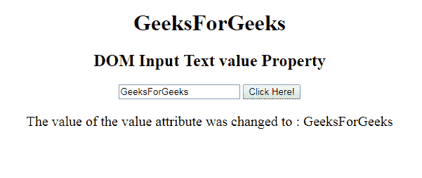

# HTML | DOM 输入文本值属性

> 原文:[https://www . geesforgeks . org/html-DOM-input-text-value-property/](https://www.geeksforgeeks.org/html-dom-input-text-value-property/)

HTML DOM 中的**输入文本值属性**用于设置或返回输入字段的值属性的值。值属性指定输入文本字段的初始值。它包含默认值或用户类型。
**语法:**

*   它返回输入文本值属性。

```html
textObject.value
```

*   它用于设置输入文本值属性。

```html
textObject.value = text
```

**属性值:**包含单值**文本**，定义输入文本字段的值。
**返回值:**返回代表文本字段值的字符串值。
**示例 1:** 本示例说明如何返回 Input Text 值属性。

## 超文本标记语言

```html
<!DOCTYPE html>
<html>

<head>
    <title>
        HTML DOM Input Text value Property
    </title>
</head>

<body style="text-align:center;">

    <h1>GeeksForGeeks</h1>

    <h2>DOM Input Text value Property</h2>

    <input type="text" id="text_id" value="Hello Geeks!">

    <button onclick="myGeeks()">Click Here!</button>

    <p id="GFG"></p>

    <!-- Script to return the Input Text value Property-->
    <script>
        function myGeeks() {
            var txt = document.getElementById("text_id").value;
            document.getElementById("GFG").innerHTML = txt;
        }
    </script>
</body>

</html>                    
```

**输出:**
**点击按钮前:**



**点击按钮后:**



**示例 2:** 本示例说明如何设置输入文本值属性。

## 超文本标记语言

```html
<!DOCTYPE html>
<html>

<head>
    <title>
        HTML DOM Input Text value Property
    </title>
</head>

<body style="text-align:center;">

    <h1>GeeksForGeeks</h1>

    <h2>DOM Input Text value Property</h2>

    <input type="text" id="text_id" value="Hello Geeks!">

    <button onclick="myGeeks()">Click Here!</button>

    <p id="GFG" style="font-size:20px;"></p>

    <!-- Script to set Input Text value Property-->
    <script>
        function myGeeks() {
            var txt = document.getElementById("text_id").value
                    = "GeeksForGeeks";

            document.getElementById("GFG").innerHTML
                    = "The value of the value attribute "
                      + "was changed to : " + txt;
        }
    </script>
</body>

</html>                   
```

**输出:**
**点击按钮前:**


**点击按钮后:**



**支持的浏览器:****DOM 输入文本值属性**支持的浏览器如下:

*   谷歌 Chrome
*   微软公司出品的 web 浏览器
*   火狐浏览器
*   歌剧
*   旅行队