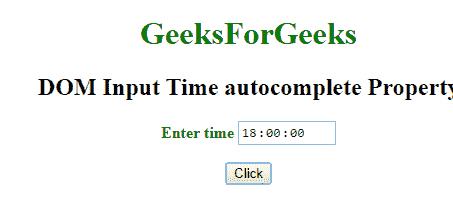
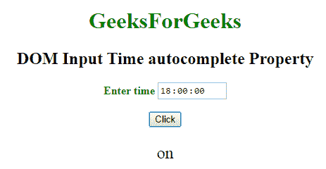
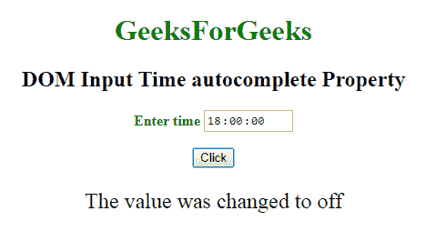

# HTML | DOM 输入时间自动完成属性

> 原文:[https://www . geesforgeks . org/html-DOM-input-time-autocomplete-property/](https://www.geeksforgeeks.org/html-dom-input-time-autocomplete-property/)

HTML DOM 中的**输入时间自动完成属性**用于设置或返回输入时间字段的自动完成属性的值。自动完成属性用于指定自动完成属性的值是“开”还是“关”。当“自动完成”属性设置为“开”时，浏览器将根据用户之前输入的值自动完成。

**语法:**

*   它返回输入时间自动完成属性。

    ```html
    timeObject.autocomplete
    ```

*   它用于设置输入时间自动完成属性。

    ```html
    timeObject.autocomplete = "on|off" 
    ```

**属性值:**包含以下两个值:

*   **开:**为默认值。它会自动完成这些值。
*   **off:** 定义用户应填写 URL 输入字段的值。它不会自动完成这些值。

**返回值:**返回一个代表自动完成状态的字符串值。

**示例-1:** 本示例说明如何返回输入时间自动完成属性。

```html
<!DOCTYPE html> 
<html> 

<head> 
    <title> 
        DOM Input Time autocomplete Property 
    </title> 
</head> 

<body> 
    <center> 
        <h1 style="color:green;"> 
            GeeksForGeeks 
        </h1> 

        <h2> 
            DOM Input Time autocomplete Property 
        </h2> 

        <label for="uname" style="color:green"> 
            <b>Enter time</b> 
        </label> 

        <input type="time" id="gfg" name="Geek_time"
            value="18:00" placeholder="Enter time"
            step="5" min="16:00" max="22:00:"
            autocomplete="on"> 

        <br><br> 

        <button type="button" onclick="geeks()"> 
            Click 
        </button> 

        <p id="GFG" style=
            "font-size:24px;color:green'"> 
        </p> 

        <script> 
            function geeks() { 

                var link = document.getElementById
                        ("gfg").autocomplete; 

                document.getElementById( 
                        "GFG").innerHTML = link; 
            } 
        </script> 
    </center> 
</body> 

</html>
```

**输出:**

*   **点击按钮前:**
    
*   **点击按钮后:**
    

**示例 2:** 本示例说明如何设置输入时间自动完成属性。

```html
<!DOCTYPE html> 
<html> 

<head> 
    <title> 
        DOM Input Time autocomplete Property 
    </title> 
</head> 

<body> 
    <center> 
        <h1 style="color:green;"> 
            GeeksForGeeks 
        </h1> 

        <h2> 
            DOM Input Time autocomplete Property 
        </h2> 

        <label for="uname" style="color:green"> 
            <b>Enter time</b> 
        </label> 

        <input type="time" id="gfg" name="Geek_time"
            value="18:00" placeholder="Enter time"
            step="5" min="16:00" max="22:00"
            autocomplete="on"> 

        <br><br> 

        <button type="button" onclick="geeks()"> 
            Click 
        </button> 

        <p id="GFG" style=
            "font-size:24px;color:green'"> 
        </p> 

        <script> 
            function geeks() { 

                var link = document.getElementById( 
                        "gfg").autocomplete="off"; 

                document.getElementById("GFG").innerHTML
                    = "The value was changed to " + link; 
            } 
        </script> 
    </center> 
</body> 

</html>
```

**输出:**

*   **点击按钮前:**
    
*   **点击按钮后:**
    

**支持的浏览器:**T2 DOM 输入时间自动完成属性支持的浏览器如下:

*   谷歌 Chrome
*   微软公司出品的 web 浏览器
*   火狐浏览器
*   苹果 Safari
*   歌剧