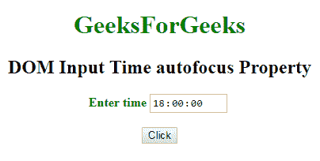

# HTML | DOM 输入时间自动对焦属性

> 原文:[https://www . geesforgeks . org/html-DOM-输入-时间-自动对焦-属性/](https://www.geeksforgeeks.org/html-dom-input-time-autofocus-property/)

HTML DOM 中的 **DOM 输入时间自动对焦属性**用于**设置**或**返回**当页面加载时*时间字段是否自动对焦。该属性用于反映 **HTML 自动对焦属性。***

**语法:**

*   它返回自动对焦属性。

    ```html
    timeObject.autofocus
    ```

*   它用于设置自动对焦属性。

    ```html
    timeObject.autofocus = true|false
    ```

**属性值:**

*   **true:** 指定时间字段获得焦点。
*   **false:** 有默认值。它指定时间字段没有获得焦点。

**返回值:**返回一个布尔值，表示页面加载时时间域是否聚焦。

**例-1:** 本例说明了如何**归还**房产。

```html
<!DOCTYPE html>
<html>

<head>
    <title>
        DOM Input Time autofocus Property
    </title>
</head>

<body>
    <center>
        <h1 style="color:green;"> 
                GeeksForGeeks 
            </h1>

        <h2>
          DOM Input Time autofocus Property
      </h2>

        <label for="uname" 
               style="color:green">
            <b>Enter time</b>
        </label>

        <input type="time" 
               id="gfg" 
               name="Geek_time" 
               value="18:00" 
               placeholder="Enter time"
               step="5" 
               min="16:00" 
               max="22:00:" 
               autofocus>

        <br>
        <br>

        <button type="button" 
                onclick="geeks()">
            Click
        </button>

        <p id="GFG"
           style="font-size:24px;
                  color:green'">
      </p>

        <script>
            function geeks() {

                var link = 
                    document.getElementById(
                      "gfg").autofocus;

                document.getElementById(
                  "GFG").innerHTML = link;
            }
        </script>
    </center>
</body>

</html>
```

**输出:**

**点击按钮前:**


**点击按钮后:**


**示例-2:** 本示例说明如何**设置**属性。

```html
<!DOCTYPE html>
<html>

<head>
    <title>
        DOM Input Time autofocus Property
    </title>
</head>

<body>
    <center>
        <h1 style="color:green;"> 
                GeeksForGeeks 
            </h1>

        <h2>DOM Input Time autofocus Property</h2>

        <label for="uname" 
               style="color:green">
            <b>Enter time</b>
        </label>

        <input type="time" 
               id="gfg" 
               name="Geek_time" 
               value="18:00"
               placeholder="Enter time" 
               step="5" 
               min="16:00" 
               max="22:00:" 
               autofocus>

        <br>
        <br>

        <button type="button" 
                onclick="geeks()">
            Click
        </button>

        <p id="GFG" 
           style="font-size:24px;
                  color:green'">
      </p>

        <script>
            function geeks() {

                var link =
                    document.getElementById(
                      "gfg").autofocus = false;

                document.getElementById(
                  "GFG").innerHTML = link;
            }
        </script>
    </center>
</body>

</html>
```

**输出:**
**点击按钮前:**


**点击按钮后:**


**支持的浏览器:**以下列出的 **DOM 输入时间自动对焦属性**支持的浏览器:

*   谷歌 Chrome
*   Internet Explorer 10.0 +
*   火狐浏览器
*   歌剧
*   旅行队