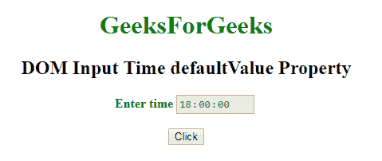
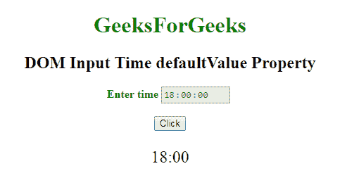
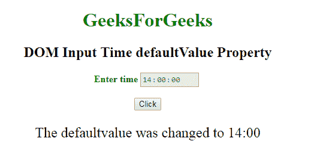

# HTML | DOM 输入时间默认值属性

> 原文:[https://www . geesforgeks . org/html-DOM-input-time-default value-property/](https://www.geeksforgeeks.org/html-dom-input-time-defaultvalue-property/)

HTML DOM 中的 **DOM 输入时间默认值属性**用于**设置**或**返回** *时间字段的默认值*。此属性用于反映 HTML 值属性。默认值与值的主要区别在于，默认值表示默认值，值包含进行一些更改后的当前值。
该属性对于确定时间字段是否已更改非常有用。
**语法:**

*   它返回 defaultValue 属性。

```html
timeObject.defaultValue
```

*   它用于设置 defaultValue 属性。

```html
timeObject.defaultValue = value
```

**属性值:**包含定义时间字段默认值的单个属性值。
**返回值:**返回一个代表时间字段默认值的字符串值。
**示例-1:** 本示例说明如何返回输入时间默认值属性。

## 超文本标记语言

```html
<!DOCTYPE html>
<html>

<head>
    <title>
        DOM Input Time defaultValue Property
    </title>
</head>

<body>
    <center>
        <h1 style="color:green;">
                GeeksForGeeks
            </h1>

        <h2>
          DOM Input Time defaultValue Property
      </h2>

        <label for="uname"
               style="color:green">
            <b>Enter time</b>
        </label>

        <input type="time"
               id="gfg"
               name="Geek_time"
               value="18:00"
               placeholder="Enter time"
               step="5"
               min="16:00"
               max="22:00"
               disabled>

        <br>
        <br>

        <button type="button"
                onclick="geeks()">
            Click
        </button>

        <p id="GFG"
           style="font-size:24px;
                  color:green'">
      </p>

        <script>
            function geeks() {

                var link =
                    document.getElementById(
                      "gfg").defaultValue;

                document.getElementById(
                  "GFG").innerHTML = link;
            }
        </script>
    </center>
</body>

</html>
```

**输出:**
**点击按钮前:**



**点击按钮后:**



**示例-2:** 本示例说明如何**设置**属性。

## 超文本标记语言

```html
<!DOCTYPE html>
<html>

<head>
    <title>
        DOM Input Time defaultValue Property
    </title>
</head>

<body>
    <center>
        <h1 style="color:green;">
                GeeksForGeeks
            </h1>

        <h2>
          DOM Input Time defaultValue Property
      </h2>

        <label for="uname"
               style="color:green">
            <b>Enter time</b>
        </label>

        <input type="time"
               id="gfg"
               name="Geek_time"
               value="18:00"
               placeholder="Enter time"
               step="5"
               min="16:00"
               max="22:00"
               disabled>

        <br>
        <br>

        <button type="button"
                onclick="geeks()">
            Click
        </button>

        <p id="GFG"
           style="font-size:24px;
                  color:green'">
      </p>

        <script>
            function geeks() {

                var link =
                    document.getElementById(
                      "gfg").defaultValue = "14:00";

                document.getElementById(
                  "GFG").innerHTML =
                  "The defaultvalue was changed to "
                + link;
            }
        </script>
    </center>
</body>

</html>
```

**输出:**
**点击按钮前:**


**点击按钮后:**



**支持的浏览器:**以下所列 **DOM 输入时间默认值属性**支持的浏览器:

*   谷歌 Chrome
*   Internet Explorer 10.0 +
*   火狐浏览器
*   歌剧
*   旅行队