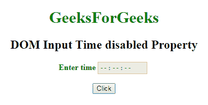
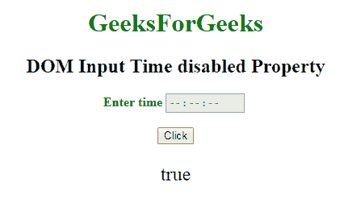
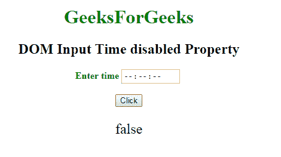

# HTML | DOM 输入时间禁用属性

> 原文:[https://www . geesforgeks . org/html-DOM-输入-时间-禁用-属性/](https://www.geeksforgeeks.org/html-dom-input-time-disabled-property/)

HTML DOM 中的 **DOM 输入时间禁用属性**用于**设置**或**返回**是否必须禁用*输入时间字段*。禁用的密码字段不可点击且不可用。它是一个布尔属性，用于反映 HTML 禁用属性。在所有浏览器中，默认情况下，它通常呈现为灰色。

**语法:**

*   它返回禁用的属性。

    ```html
    timeObject.disabled
    ```

*   它用于设置禁用属性。

    ```html
    timeObject.disabled = true|false
    ```

**属性值:**

*   **真:**定义输入时间字段被禁用。
*   **False:** 有默认值。它定义输入时间字段未被禁用。

**返回值:**返回一个布尔值，表示输入时间字段是否被禁用。

**示例-1:** 本示例说明如何返回属性。

```html
<!DOCTYPE html>
<html>

<head>
    <title>
        DOM Input Time disabled Property
    </title>
</head>

<body>
    <center>
        <h1 style="color:green;"> 
                GeeksForGeeks 
            </h1>

        <h2>
          DOM Input Time disabled Property
      </h2>

        <label for="uname"
               style="color:green">
            <b>Enter time</b>
        </label>

        <input type="time" 
               id="gfg" 
               name="Geek_time" 
               placeholder="Enter time"
               step="5" 
               min="16:00" 
               max="22:00"
               disabled>

        <br>
        <br>

        <button type="button" 
                onclick="geeks()">
            Click
        </button>

        <p id="GFG"
           style="font-size:24px;
                  color:green'">
      </p>

        <script>
            function geeks() {

                var link = 
                   document.getElementById(
                     "gfg").disabled;

                document.getElementById(
                  "GFG").innerHTML = link;
            }
        </script>
    </center>
</body>

</html>
```

**输出:**
**点击按钮前:**


**点击按钮后:**


**示例-2:** 本示例说明如何**设置**属性。

```html
<!DOCTYPE html>
<html>

<head>
    <title>
        DOM Input Time disabled Property
    </title>
</head>

<body>
    <center>
        <h1 style="color:green;"> 
                GeeksForGeeks 
            </h1>

        <h2>
          DOM Input Time disabled Property
      </h2>

        <label for="uname" 
               style="color:green">
            <b>Enter time</b>
        </label>

        <input type="time" 
               id="gfg" 
               name="Geek_time" 
               placeholder="Enter time" 
               step="5" 
               min="16:00" 
               max="22:00" 
               disabled>

        <br>
        <br>

        <button type="button" 
                onclick="geeks()">
            Click
        </button>

        <p id="GFG" 
           style="font-size:24px;
                  color:green'">
      </p>

        <script>
            function geeks() {

                var link = 
                    document.getElementById(
                      "gfg").disabled = false;

                document.getElementById(
                  "GFG").innerHTML = link;
            }
        </script>
    </center>
</body>

</html>
```

**输出:**

**点击按钮前:**


**点击按钮后:**


**支持的浏览器:**以下列出的 **DOM 输入时间禁用属性**支持的浏览器:

*   谷歌 Chrome
*   Internet Explorer 10.0 +
*   火狐浏览器
*   歌剧
*   旅行队