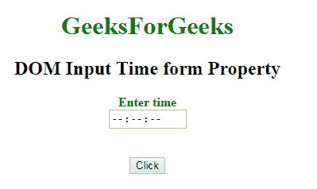
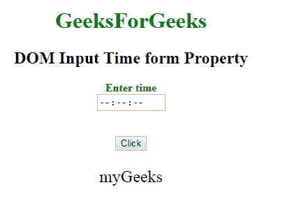

# HTML | DOM 输入时间表单属性

> 原文:[https://www . geesforgeks . org/html-DOM-input-time-form-property/](https://www.geeksforgeeks.org/html-dom-input-time-form-property/)

HTML DOM 中的 **DOM 输入时间表单属性**用于**返回** *对包含时间字段*的表单的引用。成功时返回表单对象的是只读属性。
**语法:**

```html
timeObject.form 
```

**返回值:**它返回一个字符串值，该值指定包含输入时间字段的表单的引用

**下面的程序说明了输入时间表单属性的使用。**
**例-1:** 本例说明如何归还房产。

## 超文本标记语言

```html
<!DOCTYPE html>
<html>

<head>
    <title>
        DOM Input Time form Property
    </title>
</head>

<body>
    <center>
        <h1 style="color:green;">
                GeeksForGeeks
            </h1>

        <h2>
          DOM Input Time form Property
      </h2>

        <label for="uname"
               style="color:green">
            <b>Enter time</b>
        </label>
        <form id="myGeeks">
            <input type="time"
                   id="gfg"
                   name="Geek_time"
                   placeholder="Enter time"
                   step="5"
                   min="16:00"
                   max="22:00">
        </form>
        <br>
        <br>

        <button type="button"
                onclick="geeks()">
            Click
        </button>

        <p id="GFG"
           style="font-size:24px;
                  color:green'">
      </p>

        <script>
            function geeks() {

                var link =
                    document.getElementById(
                      "gfg").form.id;

                document.getElementById(
                  "GFG").innerHTML = link;
            }
        </script>
    </center>
</body>

</html>
```

**输出:**
**点击按钮前:**



**点击按钮后:**



**支持的浏览器:**以下所列 **DOM 输入时间表单属性**支持的浏览器:

*   谷歌 Chrome
*   Internet Explorer 10.0 +
*   火狐浏览器
*   歌剧
*   旅行队