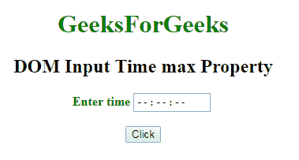
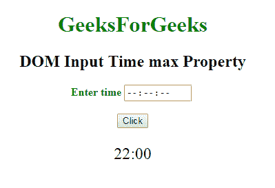
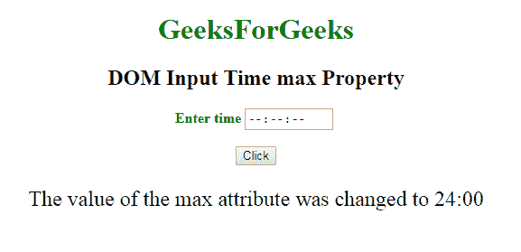

# HTML | DOM 输入时间最大属性

> 原文:[https://www . geesforgeks . org/html-DOM-input-time-max-property/](https://www.geeksforgeeks.org/html-dom-input-time-max-property/)

HTML DOM 中的 **DOM 输入时间最大属性**用于**设置**或**返回** *时间字段*的最大属性值。**最大属性**指定时间字段允许的最大时间值。

**语法:**

*   它返回 max 属性。

    ```html
    timeObject.max
    ```

*   它用于设置 max 属性。

    ```html
    timeObject.max = number
    ```

**属性值:**

*   **hh:mm:ss . ms–**用于指定时间字段允许的最长时间。
*   **hh–**它指定小时。
*   **mm-** 指定分钟。
*   **ss-** 指定秒。
*   **毫秒-** 它指定毫秒。

**返回值:**返回一个字符串值，代表时间字段允许的最长时间。

**示例-1:** 本示例说明如何返回输入时间最大属性。

```html
<!DOCTYPE html>
<html>

<head>
    <title>
        DOM Input Time max Property
    </title>
</head>

<body>
    <center>
        <h1 style="color:green;"> 
                GeeksForGeeks 
            </h1>

        <h2>
          DOM Input Time max Property
      </h2>

        <label for="uname"
               style="color:green">
            <b>Enter time</b>
        </label>

        <input type="time"
               id="gfg"
               name="Geek_time"
               placeholder="Enter time"
               step="5" 
               min="16:00"
               max="22:00">

        <br>
        <br>

        <button type="button" 
                onclick="geeks()">
            Click
        </button>

        <p id="GFG"
           style="font-size:24px;
                  color:green'">
      </p>

        <script>
            function geeks() {

                var link = 
                    document.getElementById(
                      "gfg").max;

                document.getElementById(
                  "GFG").innerHTML = link;
            }
        </script>
    </center>
</body>

</html>
```

**输出:**
**点击按钮前:**


**点击按钮后:**


**示例-2:** 本示例说明如何**设置**属性。

```html
<!DOCTYPE html>
<html>

<head>
    <title>
        DOM Input Time max Property
    </title>
</head>

<body>
    <center>
        <h1 style="color:green;"> 
                GeeksForGeeks 
            </h1>

        <h2>
          DOM Input Time max Property
      </h2>

        <label for="uname" 
               style="color:green">
            <b>Enter time</b>
        </label>

        <input type="time"
               id="gfg" 
               name="Geek_time"
               placeholder="Enter time"
               step="5" 
               min="16:00" 
               max="22:00">

        <br>
        <br>

        <button type="button"
                onclick="geeks()">
            Click
        </button>

        <p id="GFG" 
           style="font-size:24px;
                  color:green'">
      </p>

        <script>
            function geeks() {

                var link = 
                    document.getElementById(
                      "gfg").max = "24:00";

                document.getElementById(
                  "GFG").innerHTML = 
                  "The value of the max attribute"+
                  " was changed to " + link;
            }
        </script>
    </center>
</body>

</html>
```

**输出:**
**点击按钮前:**


**点击按钮后:**


**支持的浏览器:**下面列出的 **DOM 输入时间最大属性**支持的浏览器:

*   谷歌 Chrome
*   Internet Explorer 10.0 +
*   火狐浏览器
*   歌剧
*   旅行队