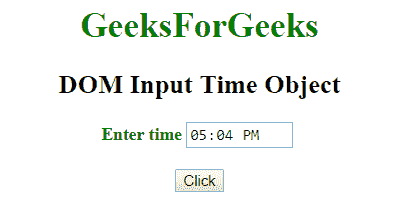
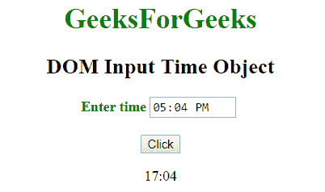
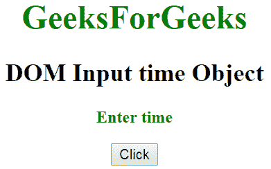
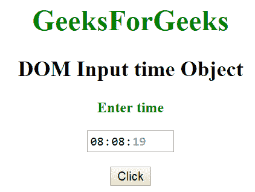

# HTML | DOM 输入时间对象

> 原文:[https://www.geeksforgeeks.org/html-dom-input-time-object/](https://www.geeksforgeeks.org/html-dom-input-time-object/)

HTML DOM 中的输入时间对象表示一个具有 type = "time "属性的<input>元素。时间属性可以通过使用 getElementById()方法来访问。

**语法:**

```html
document.getElementById("id");
```

其中 id 被分配给<input>标签。

**属性值:**

*   **列表:**返回包含时间字段的数据列表的引用。
*   **表单:**返回包含时间字段的表单的引用。
*   **自动完成:**用于设置或返回时间字段的自动完成属性的值。
*   **自动对焦:**用于设置或返回页面加载时时间字段是否应自动对焦。
*   **默认值:**用于设置或返回时间字段的默认值。
*   **禁用:**用于设置或返回时间字段是否禁用。
*   **max:** 用于设置或返回时间字段的 max 属性的值。
*   **min:** 用于设置或返回时间字段的 min 属性的值。
*   **名称:**用于设置或返回时间字段名称属性的值。
*   **只读:**用于设置或返回时间字段是否只读。
*   **必输项:**用于设置或返回提交表单前是否必须填写时间字段。
*   **大小:**用于设置或返回时间字段的大小属性值。
*   **类型:**返回时间字段所属的表单元素类型。
*   **值:**用于设置或返回时间字段的值属性的值。

**示例 1:** 本示例描述了使用 getElementById()方法访问具有 type = "time "属性的<输入>元素。

## 超文本标记语言

```html
<!DOCTYPE html>
<html>
    <head>
        <title>
            DOM Input Time Object
        </title>
    </head>

    <body>
        <center>
            <h1 style = "color:green;">
                GeeksForGeeks
            </h1>

            <h2>DOM Input Time Object</h2>

            <label for = "uname" style = "color:green">
                <b>Enter time</b>
            </label>

            <input type = "time" id = "gfg"
                placeholder = "Enter time">

            <br><br>

            <button type = "button" onclick = "geeks()">
                Click
            </button>

            <p id = "GFG"></p>

            <script>
                function geeks() {
                    var link = document.getElementById("gfg").value;
                    document.getElementById("GFG").innerHTML = link;
                }
            </script>
        </center>
    </body>
</html>                   
```

**输出:**
**之前点击按钮:**



**点击按钮后:**



**示例 2:** 本示例描述了 document.createElement()方法来创建具有 type = "time "属性的<输入>元素。

## 超文本标记语言

```html
<!DOCTYPE html>
<html>
    <head>
        <title>
            DOM Input URL Object
        </title>
    </head>

    <body>
    <center>
        <h1 style="color:green">
            GeeksForGeeks
        </h1>

        <h2>DOM Input time Object </h2>

              <label for = "uname" style = "color:green">
                <b>Enter time</b>
        </label>
           <p id="GFG"></p>

        <button type = "button" onclick = "myGeeks()">
            Click
        </button>

        <script>
            function myGeeks() {
                var link = document.createElement("INPUT");
                link.setAttribute("type", "time");
                link.setAttribute("value", "08:08:19");
                document.getElementById("GFG").appendChild(link);
            }
        </script>
        </center>
    </body>
</html>                    
```

**输出:**
**之前点击按钮:**



**之前点击按钮:**



**支持的浏览器:**

*   谷歌 Chrome
*   互联网浏览器(IE 12 之后)
*   歌剧
*   旅行队