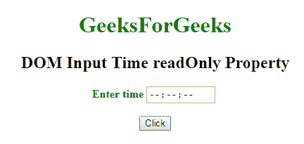
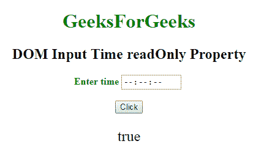
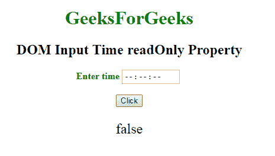

# HTML | DOM 输入时间只读属性

> 原文:[https://www . geesforgeks . org/html-DOM-input-time-readonly-property/](https://www.geeksforgeeks.org/html-dom-input-time-readonly-property/)

HTML DOM 中的 **DOM 输入时间只读属性**用于**设置**或**返回** *时间字段是否为只读*。这意味着用户不能修改或更改特定元素中已经存在的内容(但是，用户可以定位到它，突出显示它，并从中复制文本)，而 JavaScript 可以用于更改只读值并使输入字段可编辑。

**语法:**

*   它用于返回 readOnly 属性。

    ```html
    timeObject.readOnly
    ```

*   它用于设置 readOnly 属性。

    ```html
    timeObject.readOnly = true|false
    ```

**属性值:**

*   **true:** 定义时间字段为只读。
*   **false:** 定义时间字段不是只读的。

**返回值:**返回一个布尔值，表示时间字段是否为只读。

**示例-1:** 这个示例说明了如何返回属性。

```html
<!DOCTYPE html>
<html>

<head>
    <title>
        DOM Input Time readOnly Property
    </title>
</head>

<body>
    <center>
        <h1 style="color:green;"> 
                GeeksForGeeks 
            </h1>

        <h2>
          DOM Input Time readOnly Property
      </h2>

        <label for="uname"
               style="color:green">
            <b>Enter time</b>
        </label>

        <input type="time" 
               id="gfg"
               placeholder="Enter time"
               readonly>

        <br>
        <br>

        <button type="button" 
                onclick="geeks()">
            Click
        </button>

        <p id="GFG"
           style="font-size:24px;
                  color:green;">
      </p>

        <script>
            function geeks() {

                var link = 
                    document.getElementById(
                      "gfg").value;

                document.getElementById(
                  "GFG").innerHTML = link;
            }
        </script>
    </center>
</body>

</html>
```

**输出:**
**点击按钮前:**


**点击按钮后:**


**示例-2:** 本示例说明如何**设置**属性。

```html
<!DOCTYPE html>
<html>

<head>
    <title>
        DOM Input Time readOnly Property
    </title>
</head>

<body>
    <center>
        <h1 style="color:green;"> 
                GeeksForGeeks 
            </h1>

        <h2>
          DOM Input Time readOnly Property
      </h2>

        <label for="uname"
               style="color:green">
            <b>Enter time</b>
        </label>

        <input type="time" 
               id="gfg"
               placeholder="Enter time" 
               step="5"
               readonly>

        <br>
        <br>

        <button type="button" 
                onclick="geeks()">
            Click
        </button>

        <p id="GFG"
           style="font-size:24px;
                  color:green'">
      </p>

        <script>
            function geeks() {

                var link = 
                    document.getElementById(
                  "gfg").readOnly = "false";

                document.getElementById(
                  "GFG").innerHTML = link;
            }
        </script>
    </center>
</body>

</html>
```

**输出:**

**点击按钮前:**


**点击按钮后:**


**支持的浏览器:**以下列出的 **DOM 输入时间只读属性**支持的浏览器:

*   谷歌 Chrome
*   Internet Explorer 10.0 +
*   火狐浏览器
*   歌剧
*   旅行队