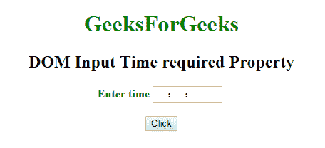
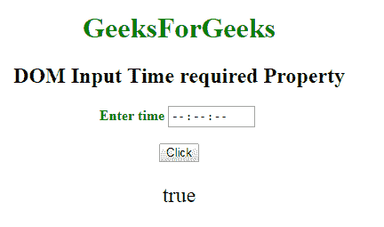
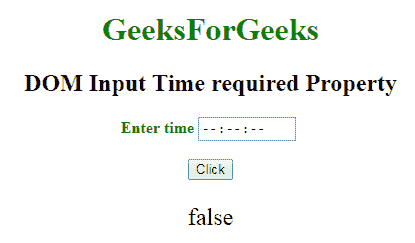

# HTML | DOM 输入所需时间属性

> 原文:[https://www . geesforgeks . org/html-DOM-input-time-required-property/](https://www.geeksforgeeks.org/html-dom-input-time-required-property/)

HTML DOM 中的 **DOM 输入时间要求属性**用于**设置**或**返回**提交表单时是否填写*输入时间字段。此属性用于反映 HTML 必需的属性。*

**语法:**

*   它返回“需要输入时间”属性。

    ```html
    timeObject.required
    ```

*   它用于设置“需要输入时间”属性。

    ```html
    timeObject.required = true|false
    ```

**属性值:**

*   **true:** 指定提交表单前必须填写时间字段。
*   **false:** 为默认值。它指定在提交表单之前不得填写时间字段。

**返回值:**返回一个布尔值，表示提交表单前是否必须填写时间字段。

**示例-1:** 本示例返回需要输入时间属性。

```html
<!DOCTYPE html>
<html>

<head>
    <title>
        DOM Input Time required Property
    </title>
</head>

<body>
    <center>
        <h1 style="color:green;"> 
                GeeksForGeeks 
            </h1>

        <h2>
          DOM Input Time required Property
      </h2>

        <label for="uname" 
               style="color:green">
            <b>Enter time</b>
        </label>

        <input type="time" 
               id="gfg"
               placeholder="Enter time" 
               step="5" 
               required>

        <br>
        <br>

        <button type="button" 
                onclick="geeks()">
            Click
        </button>

        <p id="GFG" 
           style="font-size:24px;
                  color:green'">
      </p>

        <script>
            function geeks() {

                var link = 
                    document.getElementById(
                      "gfg").required;

                document.getElementById(
                  "GFG").innerHTML = link;
            }
        </script>
    </center>
</body>

</html>
```

**输出:**
**点击按钮前:**


**点击按钮后:**


**示例-2:** 本示例说明了如何**设置**输入所需时间属性。

```html
<!DOCTYPE html>
<html>

<head>
    <title>
        DOM Input Time required Property
    </title>
</head>

<body>
    <center>
        <h1 style="color:green;"> 
                GeeksForGeeks 
            </h1>

        <h2>
          DOM Input Time required Property
      </h2>

        <label for="uname"
               style="color:green">
            <b>Enter time</b>
        </label>

        <input type="time"
               id="gfg"
               placeholder="Enter time" 
               step="5" 
               required>

        <br>
        <br>

        <button type="button" 
                onclick="geeks()">
            Click
        </button>

        <p id="GFG"
           style="font-size:24px;
                  color:green'">
      </p>

        <script>
            function geeks() {

                var link = 
                document.getElementById(
                  "gfg").required = false;

                document.getElementById(
                  "GFG").innerHTML = link;
            }
        </script>
    </center>
</body>

</html>
```

**输出:**
**点击按钮前:**


**点击按钮后:**


**支持的浏览器:****DOM 输入所需时间属性**支持的浏览器如下:

*   谷歌 Chrome
*   Internet Explorer 10.0 +
*   火狐浏览器
*   歌剧
*   旅行队