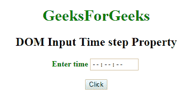
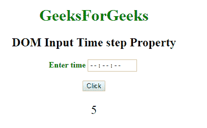
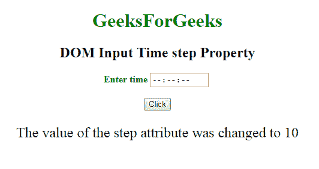

# HTML | DOM 输入时间步长属性

> 原文:[https://www . geesforgeks . org/html-DOM-input-time-step-property/](https://www.geeksforgeeks.org/html-dom-input-time-step-property/)

**DOM 输入时间步长属性**用于**设置**或**返回** *一个数字字段*的步长属性值。HTML 中的 step 属性用于在 Time 字段中指定秒和毫秒的合法间隔。步长属性可以与最小值和最大值属性一起使用来创建合法值。
**例如**如果步骤属性的值为“2”，则合法；数字将是 0，2，4，6，8 等。

**语法:**

*   它返回 step 属性。

    ```html
    timeObject.step
    ```

*   It is use to set the step property.

    ```html
    timeObject.step = number
    ```

    **属性值:**它包含一个值，即指定时间字段的合法间隔的数字。

    **For Seconds:**

    *   Use number “1”, “2”, “10” or “30” when the number of seconds will reach to 60.

        **毫秒:**

    *   它始于(。)并在毫秒数将达到 1000 时使用数字“. 010”、“. 050”、“. 20”。

    **返回值:**返回一个字符串值，代表秒或毫秒的合法数字间隔。

    **示例-1:** 本示例说明如何返回属性。

    ```html
    <!DOCTYPE html>
    <html>

    <head>
        <title>
            DOM Input Time step Property
        </title>
    </head>

    <body>
        <center>
            <h1 style="color:green;"> 
                    GeeksForGeeks 
                </h1>

            <h2>DOM Input Time step Property</h2>

            <label for="uname"
                   style="color:green">
                <b>Enter time</b>
            </label>

            <input type="time"
                   id="gfg" 
                   placeholder="Enter time"
                   step="5">

            <br>
            <br>

            <button type="button"
                    onclick="geeks()">
                Click
            </button>

            <p id="GFG" 
               style="font-size:24px;
                      color:green'">
          </p>

            <script>
                function geeks() {

                    var link =
                        document.getElementById(
                          "gfg").step;

                    document.getElementById(
                      "GFG").innerHTML = link;
                }
            </script>
        </center>
    </body>

    </html>
    ```

    **输出:**
    **点击按钮前:**
    

    **点击按钮后:**
    

    **示例-2:** 本示例说明如何**设置**属性。

    ```html
    <!DOCTYPE html>
    <html>

    <head>
        <title>
            DOM Input Time step Property
        </title>
    </head>

    <body>
        <center>
            <h1 style="color:green;"> 
                    GeeksForGeeks 
                </h1>

            <h2>
              DOM Input Time step Property
          </h2>

            <label for="uname"
                   style="color:green">
                <b>Enter time</b>
            </label>

            <input type="time" 
                   id="gfg" 
                   placeholder="Enter time" 
                   step="5">

            <br>
            <br>

            <button type="button"
                    onclick="geeks()">
                Click
            </button>

            <p id="GFG"
               style="font-size:24px;
                      color:green'">
          </p>

            <script>
                function geeks() {
                    var link =
                        document.getElementById(
                          "gfg").step = "10";

                    document.getElementById(
                      "GFG").innerHTML = 
                      "The value of the step attribute"+
                      " was changed to " + link;
                }
            </script>
        </center>
    </body>

    </html>
    ```

    **输出:**
    **点击按钮前:**
    

    **点击按钮后:**
    

    **支持的浏览器:**T2 DOM 输入时间步长属性支持的浏览器如下:

    *   谷歌 Chrome
    *   Internet Explorer 10.0 +
    *   火狐浏览器
    *   歌剧
    *   旅行队