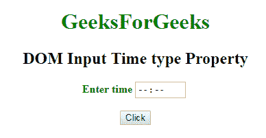
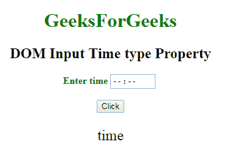

# HTML | DOM 输入时间类型属性

> 原文:[https://www . geesforgeks . org/html-DOM-input-time-type-property/](https://www.geeksforgeeks.org/html-dom-input-time-type-property/)

HTML DOM 中的 **DOM 输入时间类型属性**用于**返回** *输入时间字段*的表单元素类型。所有浏览器总是返回**“时间”**，而不是返回**“文本”**的浏览器和火狐。

**语法:**

```html
timeObject.type
```

**下面的程序说明了 HTML DOM 中的时间类型属性:**

**示例:**本示例返回 Time 字段的表单元素类型。

```html
<!DOCTYPE html>
<html>

<head>
    <title>
        DOM Input Time type Property
    </title>
</head>

<body>
    <center>
        <h1 style="color:green;"> 
                GeeksForGeeks 
            </h1>

        <h2>
          DOM Input Time type Property
      </h2>

        <label for="uname" 
               style="color:green">
            <b>Enter time</b>
        </label>

        <input type="time"
               id="gfg"
               placeholder="Enter time">

        <br>
        <br>

        <button type="button" 
                onclick="geeks()">
            Click
        </button>

        <p id="GFG"
           style="font-size:24px;
                  color:green'">
      </p>

        <script>
            function geeks() {
                var link = 
                    document.getElementById(
                      "gfg").type;

                document.getElementById(
                  "GFG").innerHTML = link;
            }
        </script>
    </center>
</body>

</html>
```

**输出:**
**点击按钮前:**


**点击按钮后:**


**支持的浏览器:**T2 DOM 输入时间类型属性支持的浏览器如下:

*   谷歌 Chrome
*   Internet Explorer 10.0 +
*   火狐浏览器
*   歌剧
*   旅行队