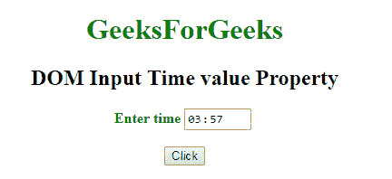
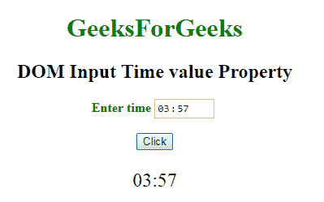
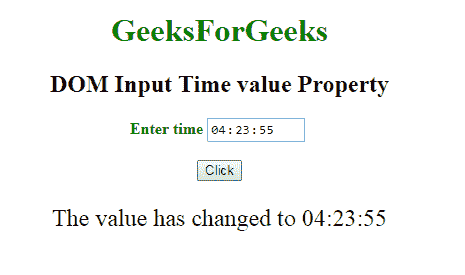

# HTML | DOM 输入时间值属性

> 原文:[https://www . geesforgeks . org/html-DOM-input-time-value-property/](https://www.geeksforgeeks.org/html-dom-input-time-value-property/)

HTML DOM 中的 **DOM 输入时间值属性**用于**设置**或**返回** *时间字段的值属性的值*。蒂耶**值属性**用于定义时间字段的时间。
**语法:**

*   它返回 value 属性。

```html
timeObject.value
```

*   它用于设置 value 属性。

```html
timeObject.value = hh:mm:ss.ms
```

**房产价值:**

*   **hh:mm:ss.ms** 用于指定时间字段的时间。
*   **hh–**它指定小时。

*   **mm-** 指定分钟。
*   **ss-** 指定秒。
*   **毫秒-** 它指定毫秒。

**返回值:**返回代表时间的字符串值。

**下面的程序说明了时间值属性的使用。**
**例-1:** 本例说明如何**归还**房产。

## 超文本标记语言

```html
<!DOCTYPE html>
<html>

<head>
    <title>
        DOM Input Time value Property
    </title>
</head>

<body>
    <center>
        <h1 style="color:green;">
                GeeksForGeeks
            </h1>

        <h2>
          DOM Input Time value Property
      </h2>

        <label for="uname"
               style="color:green">
            <b>
              Enter time
          </b>
        </label>

        <input type="time"
               id="gfg"
               placeholder="Enter time">

        <br>
        <br>

        <button type="button"
                onclick="geeks()">
            Click
        </button>

        <p id="GFG"
           style="font-size:24px;
                  color:green;">
      </p>

        <script>
            function geeks() {

                var link =
                    document.getElementById(
                      "gfg").value;

                document.getElementById(
                  "GFG").innerHTML = link;
            }
        </script>
    </center>
</body>

</html>
```

**输出:**
**点击按钮前:**



**点击按钮后:**



**示例-2:** 本示例说明如何**设置**属性。

## 超文本标记语言

```html
<!DOCTYPE html>
<html>

<head>
    <title>
        DOM Input Time value Property
    </title>
</head>

<body>
    <center>
        <h1 style="color:green;">
                GeeksForGeeks
            </h1>

        <h2>
          DOM Input Time value Property
      </h2>

        <label for="uname"
               style="color:green">
            <b>Enter time</b>
        </label>

        <input type="time"
               id="gfg"
               placeholder="Enter time">

        <br>
        <br>
        <button type="button"
                onclick="geeks()">
            Click
        </button>

        <p id="GFG"
           style="font-size:24px;
                  color:green'">
      </p>

        <script>
            function geeks() {

                var link = document.getElementById(
                  "gfg").value = "04:23:55";

                document.getElementById(
                  "GFG").innerHTML =
                  "The value has changed to " + link;
            }
        </script>
    </center>
</body>

</html>
```

**输出:**
**点击按钮前:**


**点击按钮后:**



**支持的浏览器:**以下所列 **DOM 输入时间值属性**支持的浏览器:

*   谷歌 Chrome
*   Internet Explorer 10.0 +
*   火狐浏览器
*   歌剧
*   旅行队