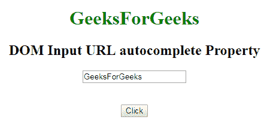
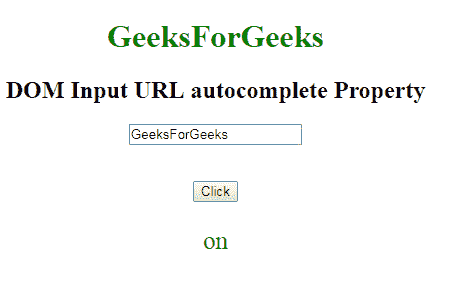
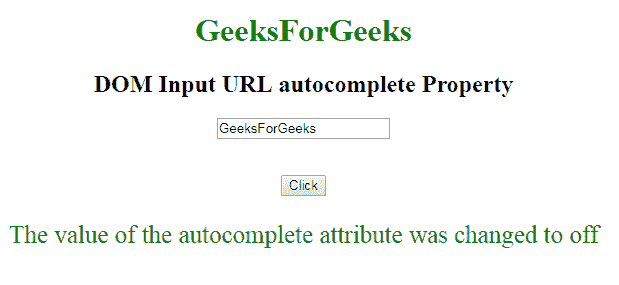

# HTML | DOM 输入 URL 自动完成属性

> 原文:[https://www . geesforgeks . org/html-DOM-input-URL-autocomplete-property/](https://www.geeksforgeeks.org/html-dom-input-url-autocomplete-property/)

HTML DOM 中的 **DOM 输入 URL 自动完成属性**用于**设置**或**返回** *一个输入 URL 字段*的自动完成属性值。自动完成属性用于指定自动完成属性是**“开”**还是**“关”**值。当“自动完成”属性设置为“开”时，浏览器将根据用户之前输入的值自动完成。

**语法:**

*   它返回输入网址自动完成属性。

    ```html
    urlObject.autocomplete
    ```

*   它用于设置输入网址自动完成属性。

    ```html
    urlObject.autocomplete = "on|off"
    ```

**属性值:**包含以下两个值:

*   **开:**为默认值。它会自动完成这些值。
*   **off:** 定义用户应填写 URL 输入字段的值。它不会自动完成这些值。

**返回值:**返回一个代表自动完成状态的字符串值。

**示例-1:** 本示例说明如何返回属性。

```html
<!DOCTYPE html>
<html>

<head>
    <title>
        DOM Input URL autocomplete Property
    </title>
</head>

<body>
    <center>
        <h1 style="color:green;"> 
                GeeksForGeeks 
            </h1>

        <h2>
          DOM Input URL autocomplete Property
      </h2>

        <label for="uname" 
               style="color:green">
      </label>

            <form id="geeks">
                <input type="url"
                       id="gfg" 
                       placeholder="Enter URL" 
                       size="20"
                       value="GeeksForGeeks" 
                       pattern="https?://.+" 
                       title="Include http://" 
                       autocomplete="on">
            </form>
            <br>
            <br>

            <button type="button" 
                    onclick="geeks()">
                Click
            </button>

            <p id="GFG" 
               style="color:green;
                      font-size:25px;">
          </p>

            <script>
                function geeks() {

                    var link =    
                     document.getElementById(
                       "gfg").autocomplete;

                    document.getElementById(
                      "GFG").innerHTML = link;
                }
            </script>
    </center>
</body>

</html>
```

**输出:**
**点击按钮前:**


**点击按钮后:**


**示例-2:** 本示例说明如何**设置**属性。

```html
<!DOCTYPE html>
<html>

<head>
    <title>
        DOM Input URL autocomplete Property
    </title>
</head>

<body>
    <center>
        <h1 style="color:green;"> 
                GeeksForGeeks 
            </h1>

        <h2>
          DOM Input URL autocomplete Property
      </h2>

        <label for="uname" 
               style="color:green">
      </label>

            <form id="geeks">
                <input type="url"
                       id="gfg" 
                       placeholder="Enter URL" 
                       size="20" 
                       value="GeeksForGeeks" 
                       pattern="https?://.+" 
                       title="Include http://" 
                       autocomplete="on">
            </form>
            <br>
            <br>

            <button type="button" 
                    onclick="geeks()">
                Click
            </button>

            <p id="GFG" 
               style="color:green;
                      font-size:25px;">
          </p>

            <script>
                function geeks() {

                    var link = 
                        document.getElementById(
                          "gfg").autocomplete = "off";

                    document.getElementById(
                      "GFG").innerHTML = 
                      "The value of the autocomplete attribute "+
                      "was changed to " + link;
                }
            </script>
    </center>
</body>

</html>
```

**输出:**
**点击按钮前:**


**点击按钮后:**


**支持的浏览器:**T2 DOM 输入 URL 自动完成属性支持的浏览器如下:

*   谷歌 Chrome
*   Internet Explorer 10.0 +
*   火狐浏览器
*   歌剧
*   旅行队