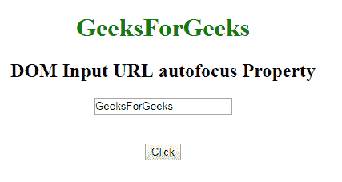
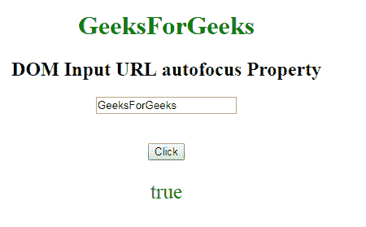
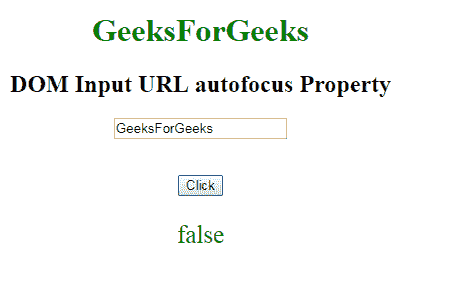

# HTML | DOM 输入 URL 自动对焦属性

> 原文:[https://www . geesforgeks . org/html-DOM-input-URL-autofocus-property/](https://www.geeksforgeeks.org/html-dom-input-url-autofocus-property/)

**DOM 输入网址自动聚焦属性**用于**设置**或**返回**页面加载时输入网址字段是否应该聚焦。此属性用于反映 HTML 自动对焦属性。

**语法:**

*   它用于返回自动对焦属性。

    ```html
    urlObject.autofocus
    ```

*   它用于设置自动对焦属性。

    ```html
    urlObject.autofocus = true|false
    ```

**属性值:**

*   **true:** It defines that a **URL** field gets focus.
*   **false:** 有默认值。它定义了**网址**字段没有焦点。

。

**返回值:**返回一个布尔值，表示网址字段是否自动聚焦。

**示例-1:** 本示例说明如何返回属性。

```html
<!DOCTYPE html>
<html>

<head>
    <title>
        DOM Input URL autofocus Property
    </title>
</head>

<body>
    <center>
        <h1 style="color:green;"> 
                GeeksForGeeks 
            </h1>

        <h2>
          DOM Input URL autofocus Property
      </h2>

        <label for="uname"
               style="color:green">
      </label>

            <form id="geeks">
                <input type="url"
                       id="gfg"
                       placeholder="Enter URL" 
                       size="20" 
                       value="GeeksForGeeks"
                       pattern="https?://.+"
                       title="Include http://" 
                       maxlength="20" 
                       autofocus>
            </form>
            <br>
            <br>

            <button type="button" 
                    onclick="geeks()">
                Click
            </button>

            <p id="GFG"
               style="color:green;
                      font-size:25px;">
          </p>

            <script>
                function geeks() {

                    var link = 
                        document.getElementById(
                          "gfg").autofocus;

                    document.getElementById(
                      "GFG").innerHTML = link;
                }
            </script>
    </center>
</body>

</html>
```

**输出**
**点击按钮前:**


**点击按钮后:**


**示例-2:** 这个示例说明了如何**设置**属性。

```html
<!DOCTYPE html>
<html>

<head>
    <title>
        DOM Input URL autofocus Property
    </title>
</head>

<body>
    <center>
        <h1 style="color:green;"> 
                GeeksForGeeks 
            </h1>

        <h2>
          DOM Input URL autofocus Property
      </h2>

        <label for="uname" 
               style="color:green">
      </label>

            <form id="geeks">
                <input type="url" 
                       id="gfg"
                       placeholder="Enter URL" 
                       size="20"
                       value="GeeksForGeeks" 
                       pattern="https?://.+" 
                       title="Include http://" 
                       maxlength="20" 
                       autofocus>
            </form>
            <br>
            <br>

            <button type="button" 
                    onclick="geeks()">
                Click
            </button>

            <p id="GFG" 
               style="color:green;
                      font-size:25px;">
      </p>

            <script>
                function geeks() {

                    var link = 
                        document.getElementById(
                          "gfg").autofocus = "false";

                    document.getElementById(
                      "GFG").innerHTML = link;
                }
            </script>
    </center>
</body>

</html>
```

**输出:**
**点击按钮前:**


**点击按钮后:**


**支持的浏览器:****DOM 输入 URL 自动对焦属性**支持的浏览器如下:

*   谷歌 Chrome
*   Internet Explorer 10.0 +
*   火狐浏览器
*   歌剧
*   旅行队