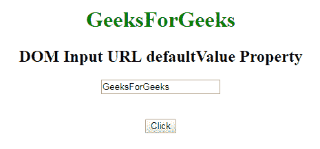
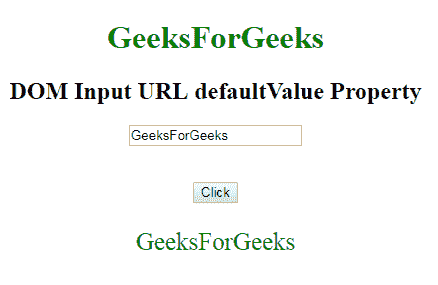
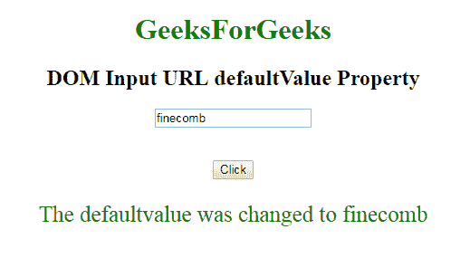

# HTML | DOM 输入 URL 默认值属性

> 原文:[https://www . geesforgeks . org/html-DOM-input-URL-defaultvalue-property/](https://www.geeksforgeeks.org/html-dom-input-url-defaultvalue-property/)

HTML DOM 中的 **DOM 输入 URL 默认值属性**用于**设置**或**返回***URL 字段的默认值*。此属性用于反映 HTML 值属性。
默认值与数值的主要区别在于，默认值表示默认值，数值包含做了一些更改后的当前值。此属性对于确定网址字段是否已被更改非常有用。

**语法:**

*   它返回 defaultValue 属性。

    ```html
    urlObject.defaultValue
    ```

*   它用于设置 defaultValue 属性。

    ```html
    urlObject.defaultValue = value
    ```

**属性值:**它包含一个定义网址字段默认值的属性值。

**返回值:**返回一个字符串值，代表网址字段的默认值。

**示例-1:** 本示例说明如何返回 Input URL defaultValue 属性。

```html
<!DOCTYPE html>
<html>

<head>
    <title>
        DOM Input URL defaultValue Property
    </title>
</head>

<body>
    <center>
        <h1 style="color:green;"> 
                GeeksForGeeks 
            </h1>

        <h2>
          DOM Input URL defaultValue Property
      </h2>

        <label for="uname"
               style="color:green">
      </label>

            <form id="geeks">
                <input type="url"
                       id="gfg"
                       placeholder="Enter URL" 
                       size="20" 
                       value="GeeksForGeeks" 
                       pattern="https?://.+"
                       title="Include http://"
                       maxlength="20">
            </form>
            <br>
            <br>

            <button type="button"
                    onclick="geeks()">
                Click
            </button>

            <p id="GFG" 
               style="color:green;font-size:25px;">
          </p>

            <script>
                function geeks() {

                    var link = 
                        document.getElementById(
                          "gfg").defaultValue;

                    document.getElementById(
                      "GFG").innerHTML = link;
                }
            </script>
    </center>
</body>

</html>
```

**输出:**
**点击按钮前:**


**点击按钮后:**


**示例-2:** 这个示例说明了如何**设置**属性。

```html
<!DOCTYPE html>
<html>

<head>
    <title>
        DOM Input URL defaultValue Property
    </title>
</head>

<body>
    <center>
        <h1 style="color:green;"> 
                GeeksForGeeks 
            </h1>

        <h2>
          DOM Input URL defaultValue Property
      </h2>

        <label for="uname"
               style="color:green">
      </label>

            <form id="geeks">
                <input type="url"
                       id="gfg" 
                       placeholder="Enter URL"
                       size="20" 
                       value="GeeksForGeeks" 
                       pattern="https?://.+"
                       title="Include http://"
                       maxlength="20">
            </form>
            <br>
            <br>

            <button type="button"
                    onclick="geeks()">
                Click
            </button>

            <p id="GFG"
               style="color:green;
                      font-size:25px;">
          </p>

            <script>
                function geeks() {

                  var link = 
                    document.getElementById(
                     "gfg").defaultValue = "finecomb";

                    document.getElementById(
                      "GFG").innerHTML = 
                      "The defaultvalue was changed to "
                    + link;
                }
            </script>
    </center>
</body>

</html>
```

**输出:**
**点击按钮前:**


**点击按钮后:**


**支持的浏览器:**下面列出了 **DOM 输入 URL defaultValue 属性**支持的浏览器:

*   谷歌 Chrome
*   Internet Explorer 10.0 +
*   火狐浏览器
*   歌剧
*   旅行队