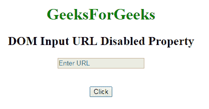
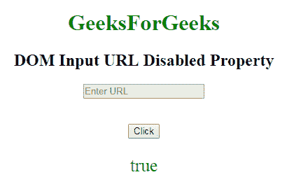
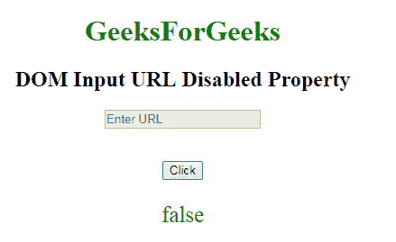

# HTML | DOM 输入 URL 禁用属性

> 原文:[https://www . geesforgeks . org/html-DOM-input-URL-disabled-property/](https://www.geeksforgeeks.org/html-dom-input-url-disabled-property/)

**DOM 输入网址禁用属性**用于**设置**或**返回**输入网址字段是否必须禁用*。禁用的网址字段不可点击且不可用。它是一个布尔属性，用于反映 HTML 禁用属性。在所有浏览器中，默认情况下，它通常呈现为灰色。* 

*   它返回禁用的属性。

```html
urlObject.disabled
```

*   它用于设置禁用属性。

```html
urlObject.disabled = true|false
```

**房产价值:**

*   **真:**定义输入网址字段被禁用。
*   **False:** 有默认值。它定义输入网址字段没有被禁用。

**返回值:**返回一个布尔值，表示输入网址字段是否被禁用。
**例-1:** 此例说明如何归还房产。

## 超文本标记语言

```html
<!DOCTYPE html>
<html>

<head>
    <title>
        DOM Input URL disabled Property
    </title>
</head>

<body>
    <center>
        <h1 style="color:green;">
                GeeksForGeeks
            </h1>

        <h2>
          DOM Input URL Disabled Property
      </h2>

        <label for="uname"
               style="color:green">
      </label>

            <form id="geeks">
                <input type="url"
                       id="gfg"
                       placeholder="Enter URL"
                       size="20"
                       pattern="https?://.+"
                       title="Include http://"
                       maxlength="20"
                       disabled>
            </form>
            <br>
            <br>

            <button type="button"
                    onclick="geeks()">
                Click
            </button>

            <p id="GFG"
               style="color:green;
                      font-size:25px;">
          </p>

            <script>
                function geeks() {

                    var link =
                        document.getElementById(
                          "gfg").disabled;

                    document.getElementById(
                      "GFG").innerHTML = link;
                }
            </script>
    </center>
</body>

</html>
```

**输出:**
**点击按钮前:**



**点击按钮后:**



**示例-2:** 本示例说明如何**设置**属性。

## 超文本标记语言

```html
<!DOCTYPE html>
<html>

<head>
    <title>
        DOM Input URL disabled Property
    </title>
</head>

<body>
    <center>
        <h1 style="color:green;">
                GeeksForGeeks
            </h1>

        <h2>
          DOM Input URL Disabled Property
      </h2>

        <label for="uname"
               style="color:green">
      </label>

            <form id="geeks">
                <input type="url"
                       id="gfg"
                       placeholder="Enter URL"
                       size="20"
                       pattern="https?://.+"
                       title="Include http://"
                       maxlength="20"
                       disabled>
            </form>
            <br>
            <br>

            <button type="button"
                    onclick="geeks()">
                Click
            </button>

            <p id="GFG"
               style="color:green;
                      font-size:25px;">
          </p>

            <script>
                function geeks() {

                    var link =
                        document.getElementById(
                          "gfg").disabled = "false";

                    document.getElementById(
                      "GFG").innerHTML = link;
                }
            </script>
    </center>
</body>

</html>
```

**输出:**
**点击按钮前:**


**点击按钮后:**



**支持的浏览器:**以下列出 **DOM 输入 URL 禁用属性**支持的浏览器:

*   谷歌 Chrome
*   Internet Explorer 10.0 +
*   火狐浏览器
*   歌剧
*   旅行队