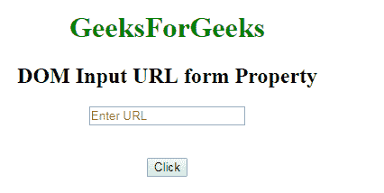

# HTML | DOM 输入 URL 表单属性

> 原文:[https://www . geesforgeks . org/html-DOM-input-URL-form-property/](https://www.geeksforgeeks.org/html-dom-input-url-form-property/)

**DOM 输入 URL 表单属性**用于**返回** *包含 URL 字段*的表单的引用。它是只读属性，并在成功时返回表单对象。
**语法:**

```html
urlObject.form
```

**返回值:**它返回一个字符串值，该值指定包含输入 URL 字段的表单的引用

**下面的程序说明了属性表单的使用。**
**例:**

## 超文本标记语言

```html
<!DOCTYPE html>
<html>

<head>
    <title>
        DOM Input URL form Property
    </title>
</head>

<body>
    <center>
        <h1 style="color:green;">
                GeeksForGeeks
            </h1>

        <h2>
          DOM Input URL form Property
      </h2>

        <label for="uname"
               style="color:green">
      </label>

            <form id="geeks">
                <input type="url"
                       id="gfg"
                       placeholder="Enter URL"
                       size="20"
                       pattern="https?://.+"
                       title="Include http://"
                       maxlength="20">
            </form>
            <br>
            <br>

            <button type="button"
                    onclick="geeks()">
                Click
            </button>

            <p id="GFG"
               style="color:green;
                      font-size:25px;">
      </p>

            <script>
                function geeks() {

                    var link =
                        document.getElementById(
                          "gfg").form.id;

                    document.getElementById(
                      "GFG").innerHTML = link;
                }
            </script>
    </center>
</body>

</html>
```

**输出:**
**点击按钮前:**



**点击按钮后:**


**支持的浏览器:**T2 DOM 输入 URL 表单属性支持的浏览器如下:

*   谷歌 Chrome
*   Internet Explorer 10.0 +
*   火狐浏览器
*   歌剧
*   旅行队